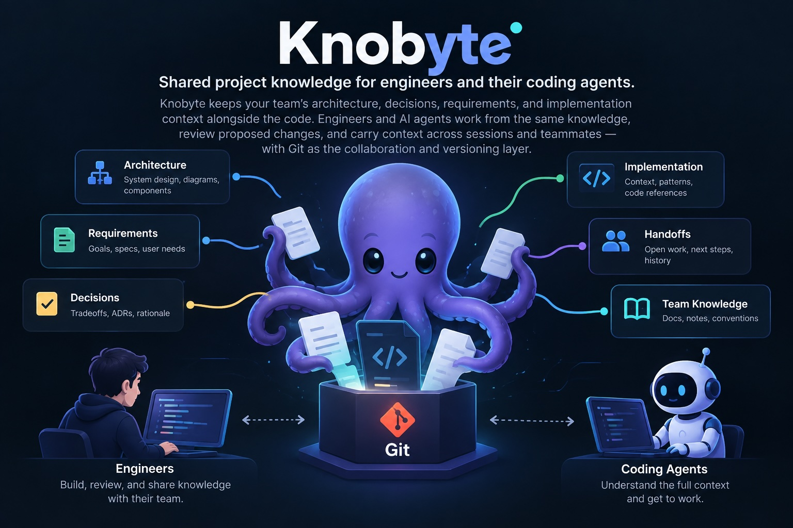
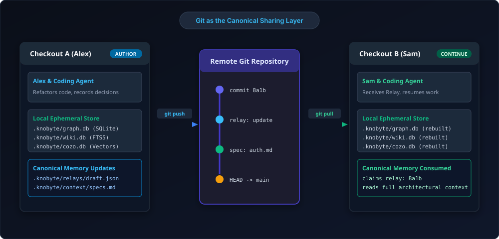
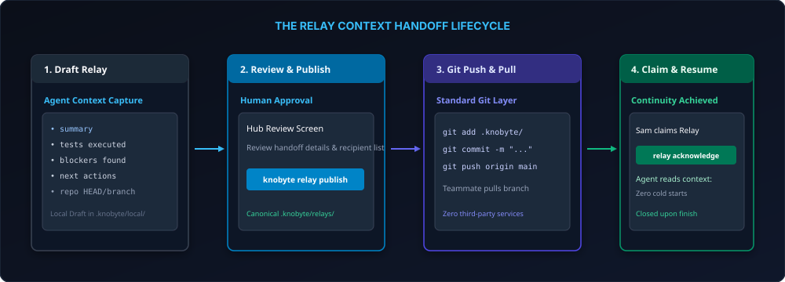
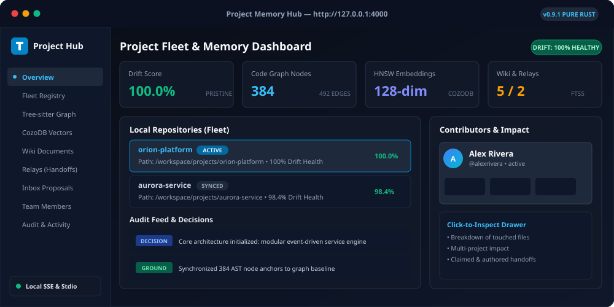
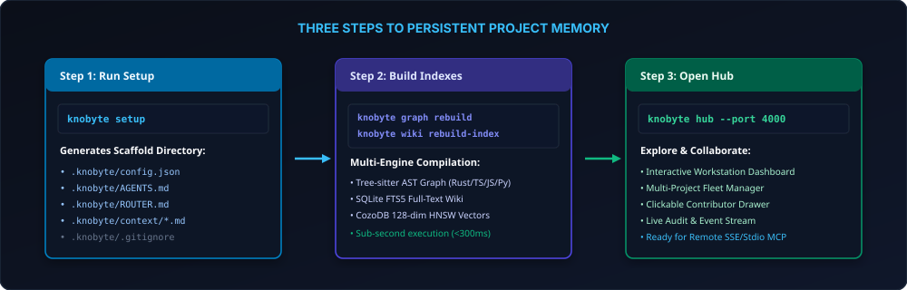
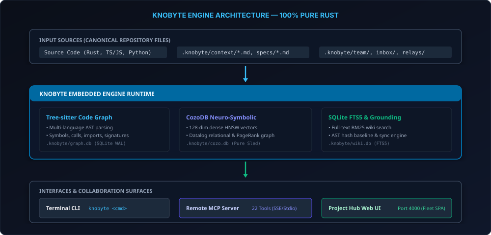
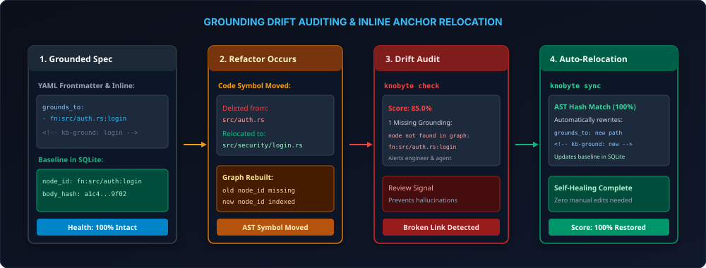
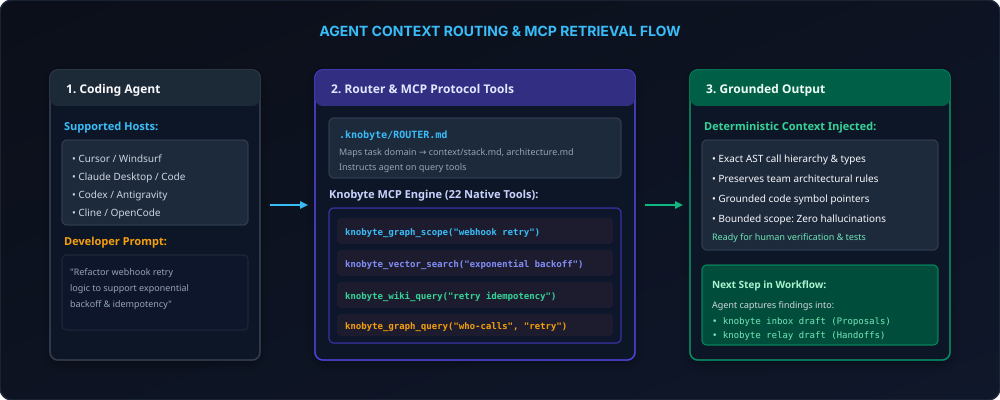
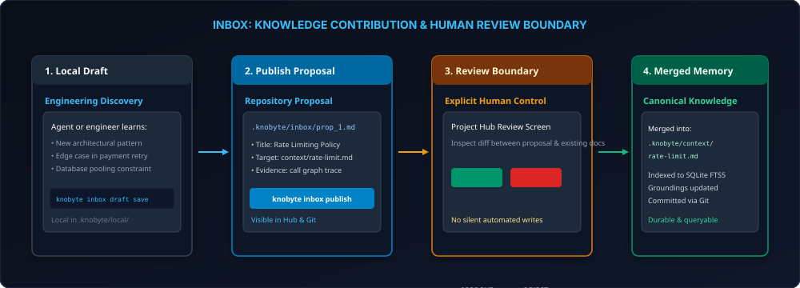

<p align="center">
  
</p>

# Knobyte

[](Cargo.toml)
[](https://knobyte.ai)
[](README.md#licensing)
[](https://www.rust-lang.org)
[](#remote-mcp-server-sse--stdio)
[](#wiki-code-graph-and-vector-intelligence)

**Shared project memory, neuro-symbolic code graphs, and vector intelligence for engineers and their coding agents — 100% pure Rust.**

Official Website: **[https://knobyte.ai](https://knobyte.ai)**

Knobyte keeps your team's architecture, decisions, requirements, code evidence, and handoffs alongside the code. Engineers and their AI agents can build on shared context, review proposed changes, and carry work between sessions and teammates—with Git as the sharing layer.

---

[What your team remembers](#what-your-team-remembers) · [From one engineer to the next](#from-one-engineer-to-the-next) · [Project Hub](#project-hub) · [Quick start](#quick-start) · [How Knobyte works](#how-knobyte-works) · [Code Graph & Vectors](#wiki-code-graph-and-vector-intelligence) · [Grounding & Auto-Relocation](#grounding-drift-detection-and-auto-relocation) · [Remote MCP Server](#remote-mcp-server-sse--stdio) · [Team workflows](#team-workflows) · [Command map](#command-map) · [Privacy](#privacy-and-trust-model) · [Licensing](#licensing)

---

One engineer knows why an architectural constraint exists. Another has the debugging history. A coding agent discovered an important edge case in a session nobody else will read. The next teammate has to piece it together all over again.

**What one engineer and their agent learn should become context the next teammate can immediately use.** Knobyte gives that knowledge a durable home in the repository: human-readable Markdown, code-linked explanations, reviewed knowledge contributions, and structured handoffs. People explore and review it in a local visual Hub; AI agents retrieve and help maintain it through the Model Context Protocol (MCP), project instructions, and the CLI.

---

## What your team remembers



| What the team needs to retain | Where it lives in Knobyte |
| --- | --- |
| **How the system works, and why** | Wiki architecture, decisions, conventions, and patterns, with Code Graph grounding |
| **A decision or explanation worth sharing** | An Inbox proposal that adds to or corrects existing Wiki knowledge |
| **Product requirements already captured** | Requirements Specs, constraints, and acceptance criteria |
| **Where another engineer should continue** | Relays carrying progress, decisions, blockers, code evidence, and next actions |
| **Earlier workflow context** | Workstream records and task roadmaps |
| **Who is involved, and what Knobyte recorded** | Team Members and canonical Activity history |
| **Semantic & Structural Code Context** | 128-dim dense HNSW vector embeddings and Datalog dependency relationships |

Canonical memory travels with ordinary Git `commit`, `push`, and `pull`. Each teammate keeps their own local indexes, drafts, identity selection, and Hub. No hosted cloud service, external database, proxy, account sign-in, or proprietary model key is required.

Working solo? The next person using that memory is **you** in a fresh session tomorrow.

---

## From one engineer to the next



An example: Alex refactors webhook retry handling, and Sam will continue the implementation. Both are active Knobyte Members in a repository their team has already initialized.

1. **Start with the team's context.** Alex asks their AI agent (Cursor, Claude, Windsurf, or Antigravity) to inspect the existing architecture, relevant decisions, and code evidence before modifying code and running tests.
2. **Capture useful discoveries.** With Alex's direction, the agent updates the relevant Wiki explanation and code references. For a conclusion the team should review, it prepares an Inbox knowledge proposal for explicit approval.
3. **Prepare and publish the handoff.** The agent drafts a Relay for Sam: what changed, which tests ran, what blockers remain, and where to look next. Alex reviews the draft in the Project Hub, explicitly publishes it, then commits and pushes the code and canonical `.knobyte/` files through Git.
4. **Continue from shared context.** Sam pulls the branch, updates his local indexes (`knobyte graph rebuild && knobyte wiki rebuild-index`), and opens the Hub (`knobyte hub`). He reviews and claims the Relay, then asks his coding agent to read its context and continue. His acknowledgement is another canonical change to commit and push.

The Relay carries the explanation and observed repository state—not uncommitted code. Publishing writes files to Alex's checkout; it does not notify Sam or deliver anything until they share through Git.

---

## Project Hub



The Project Hub is where people explore, monitor, and review their team's memory. Run `knobyte hub` to open the local dark-mode workstation dashboard on `http://localhost:4000`:

- **Fleet Overview**: Automatically discovers and tracks all local Knobyte repositories via `~/.knobyte/projects.json`, displaying real-time health donut charts and aggregate drift metrics.
- **Understand the Project**: Explore connected project knowledge and code together. The Context graph shows entities and relationships; selecting one reveals its direct code groundings and AST details.
- **Contributor Impact Drawers**: Clickable contributor cards displaying individualized contribution breakdowns, touched files, decision counts, and active in-flight handoffs.
- **Review and Carry Work Forward**: Review pending Inbox proposals, inspect Specs, and coordinate active Relays.
- **Live Audit Feed**: Chronological stream of accepted workflow events, team activities, and recorded project decisions with zero movement on hover.
- **Self-Healing Groundings**: One-click or automated anchor relocation when code symbols move across files.

Each engineer's Hub reads their own checkout and listens on `127.0.0.1`; it is not a shared hosted dashboard. Git brings the team's canonical records into that checkout.

---

## Quick Start



Knobyte is 100% pure Rust. It requires **no Node.js, no Python, and no external runtime dependencies**.

### 1. Build & Install Knobyte

```bash
# Clone and build the optimized release binary
git clone https://github.com/knobyte-ai/knobyte.git
cd knobyte
cargo build --release

# Optionally copy to PATH
sudo cp target/release/knobyte /usr/local/bin/
```

### 2. Introduce Knobyte to your Repository

Run from your project's root directory:

```bash
knobyte setup
```

This creates the `.knobyte/` scaffold:
- `.knobyte/config.json`: Project identity and configuration.
- `.knobyte/.gitignore`: Ensures derived databases and local drafts are never committed.
- `.knobyte/AGENTS.md`: Agent memory conventions and memory policy.
- `.knobyte/ROUTER.md`: Task-to-context routing map for coding agents.
- `.knobyte/context/`: Core architecture specifications (`stack.md`, `architecture.md`, `conventions.md`).

Prefer a preview first? Run `knobyte setup --dry-run`.

### 3. Build Derived Code Graph & Wiki Indexes

```bash
knobyte graph rebuild        # Builds AST symbols, calls, and imports into graph.db (syncs CozoDB)
knobyte wiki rebuild-index   # Indexes Markdown specs into wiki.db using SQLite FTS5
```

### 4. Launch the Project Hub

```bash
knobyte hub --port 4000
```
Open **[http://localhost:4000](http://localhost:4000)** to explore your project memory.

---

## Joining an Existing Repository

When pulling a repository that already uses Knobyte:

```bash
git pull origin main
knobyte graph rebuild
knobyte wiki rebuild-index
knobyte hub
```

Reuse the shared project memory; do not run `setup` again. In **Team/Members**, check the effective identity and, if needed, choose your Member record with `knobyte member select <id>`.

---

## How Knobyte Works



The team's memory is shared; the machinery that retrieves it stays local. Knobyte separates **canonical repository files** from **rebuildable indexes** so each engineer and agent works against their own checkout.

### Canonical Markdown vs. Local Ephemeral Indexes

| Commit and push to share via Git | Keep local or ephemeral; never commit |
| --- | --- |
| `.knobyte/config.json`, `.knobyte/.gitignore` | `.knobyte/graph.db*` (SQLite code graph) |
| `.knobyte/AGENTS.md`, `.knobyte/ROUTER.md` | `.knobyte/wiki.db*` (SQLite FTS5 full-text index) |
| `.knobyte/context/**`, `.knobyte/patterns/**`, `.knobyte/specs/**`, `.knobyte/topics/**` | `.knobyte/cozo.db*` (CozoDB vector & Datalog store) |
| `.knobyte/team/members/**`, `.knobyte/workstreams/**`, `.knobyte/inbox/**`, `.knobyte/relays/**` | `.knobyte/local/**`: drafts, current member selection, signing keys |
| `.knobyte/events/decisions.jsonl`, `.knobyte/events/activity/**` | Process-memory Hub state and browser sessions |

Git carries the meaning; explicit maintenance commands rebuild local indexes against each checkout's active branch.

---

## Wiki, Code Graph, and Vector Intelligence

Shared memory requires both the team's conceptual explanations and hard evidence from the implementation. Knobyte integrates three query layers:

1. **The Full-Text Wiki (SQLite FTS5)**: Fast keyword and BM25 full-text search across all markdown specifications, decisions, and architectural topics (`knobyte wiki query "<text>"`).
2. **The Deterministic Code Graph (Tree-sitter)**: Multi-language AST parsing (Rust, TypeScript, TSX, JavaScript, Python) extracting functions, structs, classes, interfaces, call hierarchies, containers, and import relationships (`knobyte graph query where-defined <name>`, `knobyte graph scope "<task>"`).
3. **Neuro-Symbolic Vector Engine (CozoDB)**: Embedded pure-Rust Sled storage powering 128-dimensional dense HNSW vector similarity search, Datalog queries, PageRank centrality, and shortest pathfinding (`knobyte cozo search "<query>"`).

```bash
# Query structural code relationships
knobyte graph scope "trace authentication middleware"
knobyte graph query where-defined run_drift_check
knobyte graph query who-calls validate_token
knobyte impact validate_token

# Neuro-symbolic vector search & graph algorithms
knobyte cozo search "JWT session token verification" --target code -k 5
knobyte cozo pagerank --damping 0.85 --iterations 20
knobyte cozo shortest-path "fn:login" "fn:verify_password"
knobyte cozo query "?[kind, count(id)] := *code_nodes{kind, id}"
```

---

## Grounding, Drift Detection, and Auto-Relocation



A Wiki claim or specification can point directly to a code symbol. Knobyte supports both YAML frontmatter groundings and inline Markdown anchors:

```markdown
---
id: kb_auth
title: Authentication Architecture
grounds_to:
  - function:src/auth.rs:validate_token
---

# Authentication Architecture

All incoming requests pass through token verification.

<!-- kb-ground: function:src/auth.rs:validate_token -->
```

### Drift Audits (`knobyte check`)
Knobyte records AST body hashes in `_knobyte_grounded_source`. When code changes, Knobyte detects whether grounded symbols are intact, changed, or missing:

```bash
knobyte check
# Output: Score: 95.0% | Groundings: 12 intact, 1 changed, 0 missing
```

### Inline Grounding Anchor Relocation (`knobyte sync`)
When functions, structs, or classes are moved during refactoring, Knobyte's self-healing engine locates where the code moved using exact AST body hashes and symbol signatures, automatically rewriting markdown frontmatter and `<!-- kb-ground -->` anchors across your documentation:

```bash
# Preview eligible anchor relocations
knobyte sync --dry-run

# Automatically relocate and repair all moved anchors
knobyte sync

# Or automatically heal groundings during drift audits
knobyte check --fix
```

---

## Remote MCP Server (SSE & Stdio)

Knobyte provides a first-class Model Context Protocol (MCP) server supporting **22 native tools** over both **Server-Sent Events (SSE)** and **Stdio**.

### Launch Remote SSE Server

```bash
knobyte mcp --sse --port 3005 --host 0.0.0.0
```
- **SSE Stream**: `http://localhost:3005/sse`
- **JSON-RPC Messages**: `http://localhost:3005/messages`
- **Inspector Dashboard**: `http://localhost:3005/dashboard`

### Configure in Claude Desktop / Cursor / Windsurf / Cline

#### Remote SSE Configuration
```json
{
  "mcpServers": {
    "knobyte": {
      "url": "http://localhost:3005/sse"
    }
  }
}
```

#### Stdio Configuration
```json
{
  "mcpServers": {
    "knobyte": {
      "command": "/path/to/knobyte",
      "args": ["mcp", "--stdio"]
    }
  }
}
```

### Available MCP Tools (22 Native Tools)

| Tool Name | Description |
|---|---|
| `knobyte_check` | Runs drift check and reports drift score, file counts, and issues (supports `fix: true`) |
| `knobyte_sync_groundings` | Automatically relocates and heals drifted grounding anchors when symbols move |
| `knobyte_graph_query` | Structural AST queries (`where-defined`, `who-calls`, `who-imports`) |
| `knobyte_graph_scope` | Bounded context neighborhood for a natural language task |
| `knobyte_graph_get` | Expand source definition and signature for node IDs |
| `knobyte_graph_status` | Returns node count, edge count, and schema status |
| `knobyte_vector_search` | 128-dim dense HNSW vector similarity search over code and wiki |
| `knobyte_cozo_datalog` | Arbitrary Datalog relational and recursive graph queries |
| `knobyte_cozo_pagerank` | PageRank graph centrality scores for code nodes |
| `knobyte_cozo_shortest_path` | BFS shortest call/import path between two symbols |
| `knobyte_wiki_query` | Full-text search across Wiki entities and docs |
| `knobyte_wiki_show` | Retrieves a specific Wiki entity by ID |
| `knobyte_wiki_list` | Lists all indexed Wiki entities |
| `knobyte_log` | Appends or reads project decisions, notes, discoveries, risks, todos |
| `knobyte_timeline` | Historical project notes and event retrieval |
| `knobyte_heartbeat` | Health check for stale files and temporary cleanup |
| `knobyte_read_file` | Read files relative to the scaffold root |
| `knobyte_relay_list` | Lists active team handoff relays |
| `knobyte_relay_draft` | Creates a local handoff relay draft |
| `knobyte_inbox_draft` | Creates an inbox knowledge proposal draft |
| `knobyte_member_list` | Lists registered team members |
| `knobyte_member_current` | Shows the active effective local identity |

---

## Agents Help Maintain Team Memory



Agents are both readers and contributors: they retrieve existing context, capture discoveries from real work, and prepare knowledge proposals or handoffs for a human to review. They never independently publish or push code without approval.

Knobyte configures host-agent instructions pointing to `.knobyte/AGENTS.md` for policy and `.knobyte/ROUTER.md` for context mapping:

| Integration | Setup Behavior | Sync Command |
|---|---|---|
| **Claude Code** | Installs project anchor and skills under `.claude/skills/` | `knobyte skills sync --tool claude` |
| **Codex** | Installs project anchor and skills under `.agents/skills/` | `knobyte skills sync --tool codex` |
| **Cursor, Windsurf, Copilot** | Configures instruction templates and native MCP SSE/Stdio | Configured via MCP settings |

### Human Approval Boundaries

| An agent can prepare | A person deliberately controls |
| --- | --- |
| Search and retrieve Wiki, Vector, or Graph evidence | Whether retrieved evidence is sufficient |
| Create a checkout-local Inbox draft | Publishing the proposal for repository review |
| Preview a bounded knowledge addition or correction | Approving or rejecting the proposed canonical change |
| Create a checkout-local Relay draft | Publishing, claiming, and closing a handoff |
| Relocate drifted grounding anchors (`knobyte sync`) | Reviewing and committing working-tree changes |

---

## Team Workflows

### 1. Members
Stable contributor records in `.knobyte/team/members/` plus a checkout-local "current member" selection for attribution. Members are attribution metadata, not passwords or permission boundaries.

```bash
knobyte member list
knobyte member select <id>
knobyte member current
```

### 2. Inbox: Propose Knowledge Additions



When an agent or engineer discovers an architectural pattern, they draft an addition in `.knobyte/local/inbox_drafts/`, publish it as a Markdown proposal, and review it explicitly before merging into `.knobyte/context/`:

```bash
knobyte inbox draft save --title "Rate Limiting Strategy" --target context/rate-limit.md --content "..." --reason "Prevent API abuse"
knobyte inbox publish <draft-id>
```

### 3. Relays: Durable Context Handoffs
A Relay packages summary, progress, blockers, next actions, and observed repository state (`HEAD`, branch, timestamp). Relays can be assigned to named teammates or opened to the entire team:

```bash
knobyte relay draft save --title "Refactor Payment Gateway" --summary "Moved to Stripe Elements"
knobyte relay publish <draft-id>
knobyte relay list
knobyte relay acknowledge <relay-id>   # Claim the handoff
knobyte relay close <relay-id>         # Mark complete
```

### 4. Project Notes: Logging & Timeline
Record decisions, discoveries, risks, and notes in `.knobyte/events/decisions.jsonl`. Teammates and agents search historical context with `knobyte timeline`:

```bash
knobyte log "Migrated token hashing from MD5 to Argon2id" --kind decision --file src/auth.rs --tag security
knobyte timeline --query "Argon2id" --kind decision --limit 10
```

---

## Command Map

Run `knobyte <command> --help` for complete command options.

| Goal | Commands |
|---|---|
| **Initialize & Inspect** | `knobyte setup`, `knobyte setup --dry-run`, `knobyte capabilities --json`, `knobyte doctor` |
| **Visual Interfaces** | `knobyte hub --port 4000`, `knobyte mcp --sse --port 3005`, `knobyte mcp --stdio` |
| **Code Graph & Navigation** | `knobyte graph status`, `knobyte graph rebuild`, `knobyte graph scope <task>`, `knobyte graph query <rel> <target>`, `knobyte impact <target>` |
| **Vectors & Datalog** | `knobyte cozo search <text>`, `knobyte cozo query <script>`, `knobyte cozo pagerank`, `knobyte cozo shortest-path <a> <b>`, `knobyte cozo sync` |
| **Wiki Documentation** | `knobyte wiki rebuild-index`, `knobyte wiki query <text>`, `knobyte wiki show <id>`, `knobyte wiki related <id>`, `knobyte wiki validate` |
| **Grounding & Auto-Relocation** | `knobyte check`, `knobyte check --fix`, `knobyte sync`, `knobyte sync --dry-run` |
| **Handoffs & Continuity** | `knobyte relay list`, `knobyte relay draft save`, `knobyte relay publish <id>`, `knobyte relay acknowledge <id>`, `knobyte relay close <id>` |
| **Knowledge Proposals** | `knobyte inbox draft list`, `knobyte inbox draft save`, `knobyte inbox publish <id>` |
| **Team & Activity** | `knobyte member list`, `knobyte member select <id>`, `knobyte activity list`, `knobyte log <msg>`, `knobyte timeline` |
| **Agent Skills** | `knobyte skills sync --tool claude`, `knobyte skills sync --tool codex` |

---

## Privacy and Trust Model

- **100% Local-First**: Knobyte does not upload records, graphs, wiki indexes, drafts, or code to any remote Knobyte server.
- **Zero Telemetry**: No background telemetry, no analytics beacons, and no tracking cookies.
- **No Cloud Credentials Needed**: SQLite, CozoDB, and Tree-sitter execute entirely on your CPU and local disk.
- **Loopback Default**: Web Hub and SSE servers bind to `127.0.0.1` by default.

---

## What Knobyte Is Not

- **Not a Cloud SaaS**: There is no remote Knobyte hosting; your team shares memory via Git.
- **Not Chat or Presence**: Knobyte provides durable handoffs and architecture records, not real-time messaging.
- **Not Jira or Issue Tracking**: Relays pass context between sessions; they do not replace project management boards.
- **Not an Autonomous Bot**: Agents prepare drafts and proposals; human engineers explicitly review and commit changes.

---

## Licensing

Knobyte is **dual licensed**.

### Open-source — AGPL-3.0

You may use, modify, and distribute Knobyte under the GNU Affero General Public License Version 3, subject to its terms.

AGPL-3.0 is a strong copyleft license designed to address software used over a network. Section 13 contains additional source-availability requirements for certain modified versions that users interact with remotely over a network.

**Commercial use is allowed under AGPL-3.0.** Being a company does not by itself require purchasing a Knobyte commercial license.

### Commercial license

Organizations that want to incorporate, modify, distribute, embed, or operate Knobyte under alternative terms may obtain a separate commercial license.

Commercial agreements can also provide negotiated enterprise terms such as support, warranties, indemnification, OEM rights, or other contractual commitments.

See `COMMERCIAL-LICENSE.md`.

### Contributions

Because Knobyte is dual licensed, covered external contributions may require acceptance of the Knobyte Contributor License Agreement. See `CONTRIBUTING.md` and `CLA.md`.
