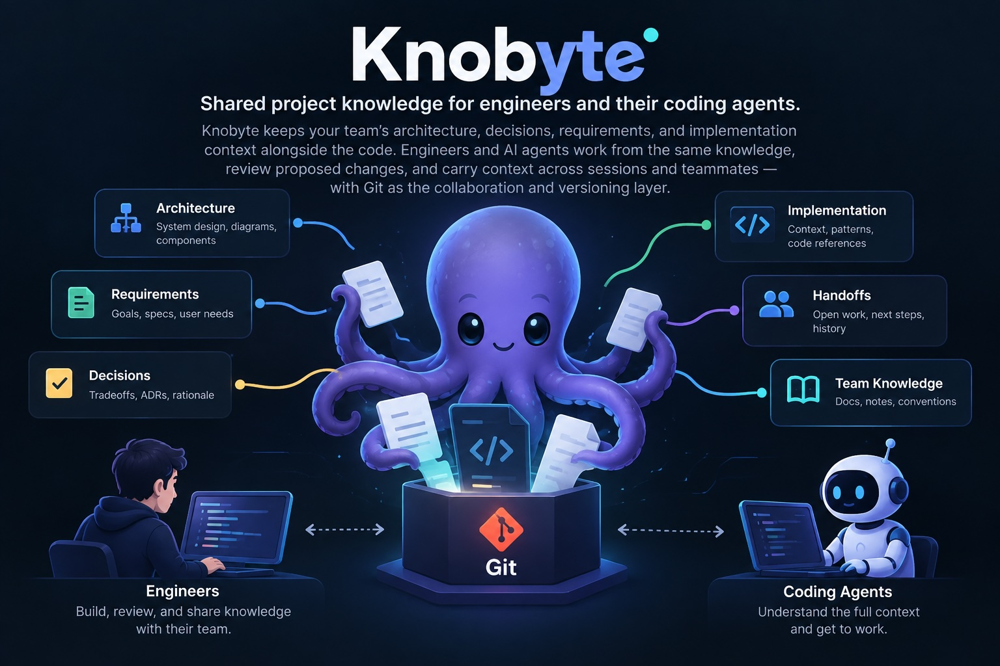
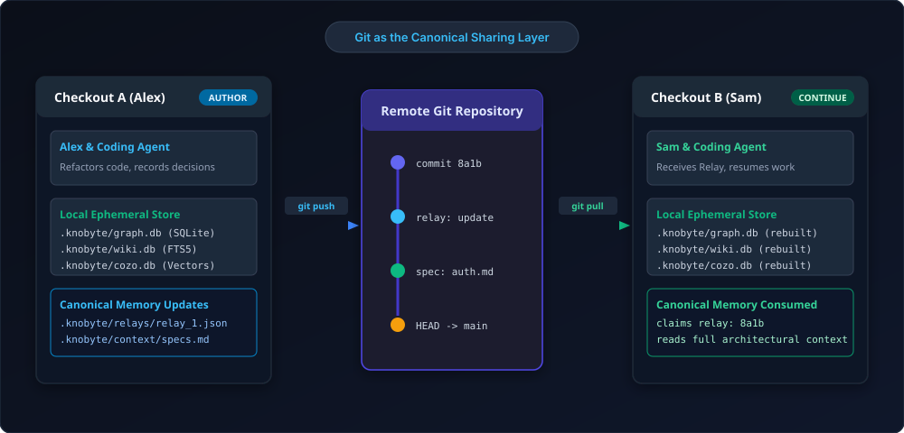
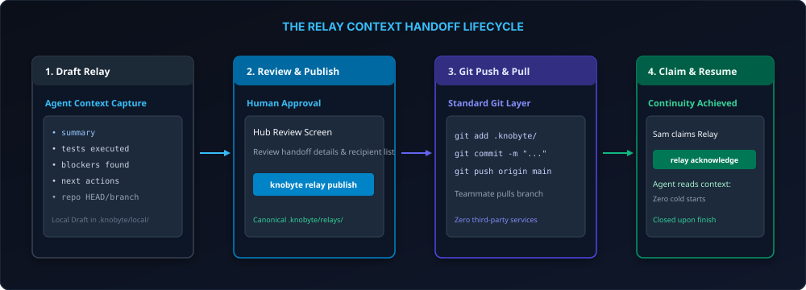
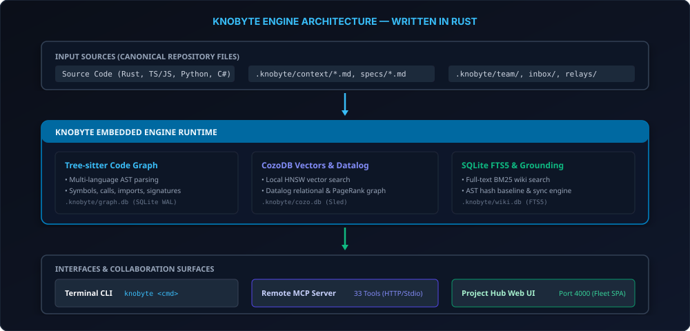
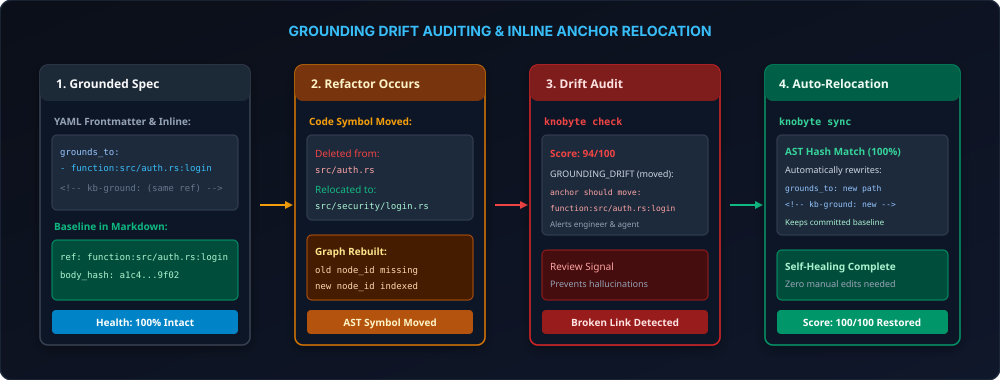

<p align="center">
  
</p>

# Knobyte

[](Cargo.toml)
[](https://knobyte.ai)
[](README.md#licensing)
[](https://www.rust-lang.org)
[](docs/mcp-setup.md)
[](docs/code-graph-and-vector.md)

**Shared project memory, a deterministic code graph and local vector search for engineers and their coding agents. Written in Rust, shipped as a single binary.**

Official Website: **[https://knobyte.ai](https://knobyte.ai)**

Knobyte keeps your team's architecture, decisions, requirements, code evidence and handoffs in
the repository, next to the code. Engineers and their agents build on shared context, review
proposed changes, and carry work between sessions and teammates, with Git as the sharing layer.
It stores everything in its own `.knobyte/` formats and adds vector search, Datalog graph analytics,
readable code groundings with automatic relocation, and a multi-repository Hub.

[Quick start](#quick-start) · [What it does](#what-it-does) · [How it works](#how-it-works) · [Command map](#command-map) · [Privacy](#privacy-and-trust) · [Documentation](#documentation) · [Licensing](#licensing)

---

## Quick start

**Download** a prebuilt binary for macOS (Apple Silicon), Linux (x86-64, arm64) or Windows from the
[latest release](https://github.com/gustaveherbst/knobyte/releases/latest), extract it and put
`knobyte` on your `PATH`. On macOS, clear the download quarantine flag once, or macOS will refuse to
open it:

```bash
xattr -d com.apple.quarantine /path/to/knobyte
```

**Or build from source**, then set up a repository:

```bash
# 1. Build (Rust 1.90+ and a C compiler; no Node, Python or database server at runtime)
git clone https://github.com/knobyte-ai/knobyte.git && cd knobyte
cargo install --path .

# 2. Set up a repository: scaffold, agent files, skills and code graph
cd /path/to/your/project
knobyte setup --tools claude,codex       # also: cursor, windsurf, copilot, opencode, none

# 3. Populate: confirm the agent launch, or paste the printed prompt into your agent,
#    then run setup again to capture grounding baselines and build the wiki index
knobyte setup

# 4. Check, register yourself, explore
knobyte check
knobyte member add alex --name "Alex Rivera" --select
knobyte hub                               # opens a one-time sign-in link in your browser
```

```text
$ knobyte check
Drift score: 100/100 — 0 errors, 0 warnings, 0 info
12 files checked
Groundings: 100.0% intact (3 intact, 0 changed, 0 moved, 0 ambiguous, 0 gone, 0 unverified of 3)
graph fresh
[ok] All scaffold files pristine and in sync with codebase.
```

When you join a repository that already uses Knobyte, build your local indexes with
`knobyte graph rebuild && knobyte wiki rebuild-index`. [Getting started](docs/getting-started.md)
walks through all of this with real output.

---

## What it does



| The team needs | Knobyte provides |
| --- | --- |
| How the system works, and why | A typed **wiki** of architecture, components, decisions, conventions, patterns and specs, editable by hand or through audited operations ([Wiki](docs/wiki.md)) |
| Knowledge that stays true | **Groundings** from claims to code symbols (`kind:path:qualified_name`) with committed baselines; `check` scores drift and `sync` relocates moved symbols ([Grounding and drift](docs/grounding-and-drift.md)) |
| Fast, exact code context | A Tree-sitter **code graph** (Rust, TypeScript/JavaScript, Python, C#, Swift, framework routes): `scope`, `query`, `get`, `impact`, plus optional TypeScript type-checker resolution ([Code graph](docs/code-graph-and-vector.md)) |
| Similarity and graph analytics | Embedded **CozoDB**: HNSW vector search over code and wiki, Datalog, PageRank and shortest path, with local hashed or Model2Vec embeddings |
| Reviewed contributions | The **Inbox**: typed knowledge and spec proposals, a teammate review, and a self-approval guard |
| Handoffs | **Relays** carrying progress, decisions, blockers, evidence and next actions to named teammates or the whole team |
| Continuity | **Workstreams** with steps and checkpoints, canonical **Activity**, and the decision/event **timeline** |
| Agents that know all this | `setup --tools` instruction files and skills, plus an **MCP server** with 30 tools in profiles (15-tool `core` by default) ([Agent integration](docs/agent-integration.md), [MCP](docs/mcp-setup.md)) |
| A place for people | The local **Project Hub**: context explorer, knowledge pages with drift panels, hybrid search, Inbox review, Relays, Team, Fleet, Jobs and a setup wizard ([Hub](docs/hub.md)) |

### From one engineer to the next



1. Alex's agent reads the project's context (`ROUTER.md`, `knobyte graph scope`) before changing
   code.
2. It drafts an Inbox proposal for a decision worth sharing, and a Relay for Sam.
3. Alex reviews and publishes both, then commits and pushes.
4. Sam pulls, rebuilds the local indexes and approves the proposal; Knobyte refuses
   self-approval without `--self-approve`. Sam acknowledges the relay, continues the work, and
   closes the relay when it is done.

Agents prepare drafts; people publish, approve, claim and push. No MCP tool approves, rejects or
publishes. [Team workflows](docs/team-memory-workflows.md) has the details: preview/apply
envelopes, actors, exit codes, Inbox states and relay rules.

---

## How it works



| Commit and share through Git | Local to each checkout (git-ignored) |
| --- | --- |
| `.knobyte/config.json`, `AGENTS.md`, `ROUTER.md`, `SETUP.md`, `SYNC.md` | `.knobyte/graph.db` (code graph, SQLite) |
| `.knobyte/context/`, `patterns/`, `specs/`, `topics/` (wiki, with grounding baselines) | `.knobyte/wiki.db` (wiki index, SQLite FTS5) |
| `.knobyte/team/members/`, `workstreams/`, `inbox/`, `relays/` | `.knobyte/cozo.db` (vectors and Datalog) |
| `.knobyte/events/decisions.jsonl`, `events/activity/`, `events/operations.jsonl` | `.knobyte/local/`: drafts, current member, signing key, journals |
| `CLAUDE.md` / `AGENTS.md` managed blocks, `.claude/skills/`, `.agents/skills/`, tool rule files | `~/.knobyte/projects.json` (Hub fleet), `~/.knobyte/models/` |

The Markdown and JSON are canonical. Every index can be rebuilt from them.



---

## Command map

`knobyte commands` prints this overview in the terminal. The [CLI reference](docs/cli-reference.md)
documents every flag.

| Goal | Commands |
|---|---|
| **Set up & maintain** | `knobyte setup [--tools …] [--mode …] [--dry-run]`, `knobyte update`, `knobyte init`, `knobyte skills sync`, `knobyte pattern add <name>` |
| **Health** | `knobyte check [--fix] [--json]`, `knobyte sync [--dry-run]`, `knobyte doctor`, `knobyte heartbeat`, `knobyte watch`, `knobyte tui` |
| **Code graph** | `knobyte graph` (build), `knobyte graph status`, `knobyte graph refresh`, `knobyte graph rebuild`, `knobyte graph repair`, `knobyte graph query <where-defined\|who-calls\|what-calls\|who-imports> <symbol>`, `knobyte graph scope "<task>"`, `knobyte graph get <id…>`, `knobyte graph ground`, `knobyte impact <target>` |
| **Vectors & Datalog** | `knobyte cozo search <text>`, `knobyte cozo query <script>`, `knobyte cozo pagerank`, `knobyte cozo shortest-path <a> <b>`, `knobyte cozo sync`, `knobyte cozo model status`, `knobyte cozo model pull`, `knobyte cozo model use <backend>` |
| **Wiki** | `knobyte wiki list`, `knobyte wiki query`, `knobyte wiki show`, `knobyte wiki related`, `knobyte wiki backlinks`, `knobyte wiki for-code`, `knobyte wiki graph`, `knobyte wiki trace`, `knobyte wiki validate`, `knobyte wiki apply <ops.json>`, `knobyte wiki migrate`, `knobyte wiki regenerate-views`, `knobyte wiki synthesis build`, `knobyte wiki rebuild-index`, `knobyte wiki index status`, `knobyte export` |
| **Inbox** | `knobyte inbox target <id>`, `knobyte inbox draft save`, `knobyte inbox publish <draft>`, `knobyte inbox proposal list`, `knobyte inbox approve <id>`, `knobyte inbox reject <id>`, `knobyte inbox withdraw <id>`, `knobyte inbox proposal mark-stale <id>`, `knobyte inbox proposal repair <id>` |
| **Relays** | `knobyte relay draft save`, `knobyte relay publish <draft>`, `knobyte relay list`, `knobyte relay show <id>`, `knobyte relay acknowledge <id>`, `knobyte relay close <id>` |
| **Team** | `knobyte member add`, `knobyte member select`, `knobyte member current`, `knobyte workstream create`, `knobyte workstream update`, `knobyte spec list`, `knobyte spec show`, `knobyte activity list`, `knobyte activity timeline`, `knobyte <group> contract` |
| **Notes** | `knobyte log "<message>" --kind decision`, `knobyte timeline`, `knobyte logging` |
| **Interfaces** | `knobyte hub [--port] [--host] [--token]`, `knobyte mcp [--stdio] [--host] [--port] [--token]`, `knobyte capabilities --json`, `knobyte completion <shell>` |

Team mutations accept `--preview`, `--apply <envelope>`, `--request <file>` and
`--operation-id`. Exit codes are 0 for OK, 1 for validation, 2 for usage, 3 for unavailable,
4 for conflict and 5 for refused.

---

## Privacy and trust

- **Local-first:** records, graphs, indexes, drafts and code never leave your machine.
  No hosted service, account, proxy or model API key is needed.
- **One explicit download:** the only network access is `knobyte cozo model pull`, which fetches a
  Model2Vec model from Hugging Face when you run it. The default `hashed` embeddings need nothing.
- **No telemetry:** no analytics, no tracking, no feedback or community prompts.
- **Agent launches need consent:** `setup` and `sync` start Claude Code or Codex only after you
  confirm, or with `--launch-agent`. They show the exact command and allowed tools first, and
  `KNOBYTE_NO_AGENT_LAUNCH=1` turns launching off.
- **Locked-down interfaces:**
  - The Hub requires a one-time sign-in link and a session cookie, even on loopback, and every
    write is CSRF-protected.
  - The Hub and the MCP HTTP server bind to `127.0.0.1` and validate `Host` and `Origin`.
    Binding elsewhere requires a token, which is generated if you do not provide one.
- **Not autonomous:** agents prepare drafts; people approve, publish, commit and push.

---

## Documentation

| Guide | |
|---|---|
| [Getting started](docs/getting-started.md) | Build, setup, populate, first check, joining a repository |
| [Agent integration](docs/agent-integration.md) | Files per agent tool, managed blocks, skills, launch consent, maintenance commands |
| [Grounding and drift](docs/grounding-and-drift.md) | References, committed baselines, scoring, checker codes, `sync`, `graph ground` |
| [Wiki](docs/wiki.md) | Entities, markers, operations, validation, migrate, synthesis, envelopes |
| [Code graph and vectors](docs/code-graph-and-vector.md) | Extraction, TypeScript compiler mode, queries, CozoDB, embeddings |
| [Team workflows](docs/team-memory-workflows.md) | Actors, preview/apply, Inbox, Relays, Members, Workstreams, Specs, Activity |
| [Project Hub](docs/hub.md) | Sign-in, pages, jobs, setup wizard, Fleet |
| [MCP server](docs/mcp-setup.md) | Transports, security, client setup, tool profiles, all 30 tools |
| [CLI reference](docs/cli-reference.md) | Every command and flag |
| [Releasing](docs/releasing.md) | Release builds, platform downloads, macOS install note |

---

## What Knobyte is not

- **Not a cloud service.** There is no hosted Knobyte. Teams share memory through Git.
- **Not chat or presence.** It holds durable handoffs and records, not real-time messages.
- **Not an issue tracker.** Relays and workstreams carry context; they do not replace your board.
- **Not an autonomous bot.** Agents propose; people decide.

---

## Licensing

Knobyte is **dual licensed**.

### Open-source — AGPL-3.0

You may use, modify, and distribute Knobyte under the GNU Affero General Public License Version 3, subject to its terms. The full license text is in [`LICENSE`](LICENSE). Third-party notices are in [`NOTICE`](NOTICE); in particular, `src/cozo/sled_store.rs` is derived from CozoDB and remains under the Mozilla Public License 2.0.

AGPL-3.0 is a strong copyleft license designed to address software used over a network. Section 13 contains additional source-availability requirements for certain modified versions that users interact with remotely over a network.

**Commercial use is allowed under AGPL-3.0.** Being a company does not by itself require purchasing a Knobyte commercial license.

### Commercial license

Organizations that want to incorporate, modify, distribute, embed, or operate Knobyte under alternative terms may obtain a separate commercial license.

Commercial agreements can also provide negotiated enterprise terms such as support, warranties, indemnification, OEM rights, or other contractual commitments.

See `COMMERCIAL-LICENSE.md`.

### Contributions

Because Knobyte is dual licensed, covered external contributions may require acceptance of the Knobyte Contributor License Agreement. See `CONTRIBUTING.md` and `CLA.md`.
