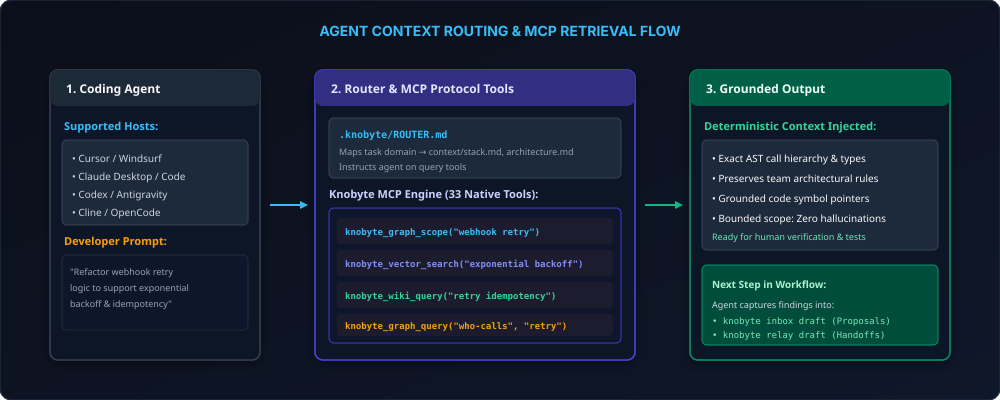

# Agent Integration



Official Website: **[https://knobyte.ai](https://knobyte.ai)**

Knobyte works with coding agents in three ways:

- **Instruction files** point the agent at `.knobyte/AGENTS.md` and `.knobyte/ROUTER.md`.
- **Skills** teach Claude Code and Codex the Inbox and Relay workflows.
- **The MCP server** (`knobyte mcp --stdio --profile core`) lets the agent query the graph, the
  wiki and team memory as tools; the CLI offers the same.

`knobyte setup` installs all three for every tool you use.

---

## Which tools setup wires

Setup detects the tools on your machine and preselects them:

| Tool | Detected from |
|---|---|
| Claude Code (`claude`) | `claude` on `PATH`, `~/.claude`, `.claude/` in the project |
| Codex (`codex`) | `codex` on `PATH`, `~/.codex`, `.codex/` in the project |
| Cursor (`cursor`) | `cursor` on `PATH`, `/Applications/Cursor.app`, `~/.cursor`, `.cursor/` in the project |
| Windsurf (`windsurf`) | `windsurf` on `PATH`, `/Applications/Windsurf.app`, `~/.codeium/windsurf`, `.windsurf/` in the project |
| VS Code / GitHub Copilot (`copilot`) | `code` or `code-insiders` on `PATH`, `/Applications/Visual Studio Code.app`, `.vscode/` in the project |
| OpenCode (`opencode`) | `opencode` on `PATH`, `~/.config/opencode`, `.opencode/` in the project |

The tool list is chosen in this order:

1. `--tools` (comma separated, or `none`);
2. the `aiTools` saved in `.knobyte/config.json` (a re-run, or a teammate's repository);
3. the detected tools. In a terminal, setup shows them once and asks
   `Set up Knobyte for Claude Code, Cursor? [Y/n/e = edit list]`; without a terminal it uses
   them as they are;
4. when nothing is detected, `AGENTS.md` and `CLAUDE.md` (read by most coding agents), without
   MCP configuration. Setup says so.

The choice is saved to `aiTools`.

```bash
knobyte setup                                  # detected tools
knobyte setup --tools claude,codex,cursor,windsurf,copilot,opencode
knobyte setup --tools cursor --no-mcp          # instruction files only
```

### Instruction files and skills

| Tool | Files written |
|---|---|
| `claude` | A managed block in `CLAUDE.md`. Skills in `.claude/skills/knobyte-inbox/` and `.claude/skills/knobyte-relay/`. |
| `codex` | A managed block in `AGENTS.md` (repository root). Skills in `.agents/skills/knobyte-inbox/` and `.agents/skills/knobyte-relay/`. |
| `cursor` | `.cursorrules` |
| `windsurf` | `.windsurfrules` |
| `copilot` | `.github/copilot-instructions.md` |
| `opencode` | `opencode.json` (project root), with `"instructions": [".knobyte/AGENTS.md", ".knobyte/ROUTER.md"]` |

### MCP server registration

Each selected tool also gets Knobyte's MCP server with the `core` tool profile. The command is
`knobyte` when that name on your `PATH` is the binary running setup; otherwise it is the binary's
absolute path.

| Tool | File | Entry |
|---|---|---|
| Claude Code | `.mcp.json` | `mcpServers.knobyte`: `{"command": "knobyte", "args": ["mcp", "--stdio", "--profile", "core"]}` |
| Cursor | `.cursor/mcp.json` | `mcpServers.knobyte`, with `"--root", "${workspaceFolder}"` appended to the args |
| VS Code / Copilot | `.vscode/mcp.json` | `servers.knobyte`: `{"type": "stdio", "command": …, "args": [… "--root", "${workspaceFolder}"]}` |
| OpenCode | `opencode.json` | `mcp.knobyte`: `{"type": "local", "command": ["knobyte", "mcp", "--stdio", "--profile", "core"], "enabled": true}` |
| Codex | `.codex/config.toml` | `[mcp_servers.knobyte]` with `command` and `args`. Codex reads project configuration only in projects you trust. |
| Windsurf | `~/.codeium/windsurf/mcp_config.json` (user-level) | `mcpServers.knobyte`, with `"--root", "<project path>"` appended |

- **Project files** contain no secrets and are part of the commit checkpoint.
- **Windsurf** has no project-level MCP file, so its entry is user-level and names this
  project's path. Setup writes it only after a confirmation that names the file, or with
  `--global-mcp`. Otherwise (and always without a terminal) it prints the entry to add yourself.
  Setup never changes a user-level file without one of the two.
- **Merging is non-destructive:** the file is parsed, only the `knobyte` entry is added or
  updated, and every other server, key, comment (JSONC) and the formatting are kept. A file
  that cannot be parsed is left untouched; setup reports it and prints the entry. Re-running
  setup changes nothing.
- `--no-mcp` skips registration. [MCP](mcp-setup.md) covers the server itself.

With an existing `opencode.json` (its `$schema` and `theme` keys are kept):

```text
$ knobyte setup --tools claude,cursor,copilot,opencode,codex --no-agent
...
AI tools
[ok] Created .cursorrules
[ok] Created .github/copilot-instructions.md
[ok] Added a Knobyte pointer to your existing opencode.json
[ok] Install the knobyte-inbox skill at .claude/skills/knobyte-inbox.
[ok] Install the knobyte-relay skill at .claude/skills/knobyte-relay.
[ok] Create CLAUDE.md with the managed Knobyte instruction block.
[ok] Install the knobyte-inbox skill at .agents/skills/knobyte-inbox.
[ok] Install the knobyte-relay skill at .agents/skills/knobyte-relay.
[ok] Create AGENTS.md with the managed Knobyte instruction block.
[ok] Created .mcp.json (Knobyte MCP server for Claude Code)
[ok] Created .cursor/mcp.json (Knobyte MCP server for Cursor)
[ok] Created .vscode/mcp.json (Knobyte MCP server for GitHub Copilot)
[ok] Added the Knobyte MCP server to opencode.json (OpenCode)
[ok] Created .codex/config.toml (Knobyte MCP server for Codex); Codex loads project config only once you trust this project
```

```json
{
  "$schema": "https://opencode.ai/config.json",
  "theme": "opencode",
  "instructions": [".knobyte/AGENTS.md"],
  "mcp": {
    "knobyte": {
      "type": "local",
      "command": ["knobyte", "mcp", "--stdio", "--profile", "core"],
      "enabled": true
    }
  }
}
```

For Windsurf without consent, setup prints
`Windsurf reads MCP servers only from the user-level ~/.codeium/windsurf/mcp_config.json; not changed (rerun with --global-mcp, or add this entry yourself):`
followed by the entry.

### Your files are not clobbered

- **`CLAUDE.md` / `AGENTS.md`:** Knobyte owns only the block between
  `<!-- knobyte-agent:skills:start -->` and `<!-- knobyte-agent:skills:end -->`. A missing file
  is created. In an existing file the block is appended or replaced, and every other byte is
  kept.
- **`.cursorrules`, `.windsurfrules`, `copilot-instructions.md`:**
  - A missing file gets Knobyte's full rules. The first line marks it as a managed copy, so
    `knobyte check` can detect copies that have drifted apart (`TOOL_CONFIG_DRIFT`).
  - An existing file that already mentions `.knobyte/` is left alone.
  - Any other existing file gets a short pointer block between `<!-- knobyte-anchor:start -->`
    and `<!-- knobyte-anchor:end -->`.
- **`opencode.json`:** `.knobyte/AGENTS.md` is added to an existing `instructions` array,
  keeping the rest of the file as it is.
- **Conflicts:** malformed markers, invalid UTF-8 or an oversized block leave the file untouched,
  and setup prints the line to add yourself.

The managed block for Claude Code looks like this:

```markdown
<!-- knobyte-agent:skills:start -->
## Knobyte agent skills
- At the start of every session, read `.knobyte/AGENTS.md` and `.knobyte/ROUTER.md` before project work; follow `ROUTER.md` to load only the relevant context.
- If any `.knobyte/` file still contains a `<!-- knobyte:populate -->` marker, population is pending: before other work, fill those files from the code (run `knobyte setup --print-prompt` for the full instructions), remove each marker, then run `knobyte setup --finish`.
- Read `knobyte logging --json` at session start and before optional logging: ...
- When earlier work may inform the task, search history with `knobyte timeline` ...
- Use `/knobyte-inbox` for explicit contributions to project knowledge and `/knobyte-relay` for durable team handoffs. ...
- Skill activation is not approval for canonical actions.
<!-- knobyte-agent:skills:end -->
```

For Codex the skills are referenced as `$knobyte-inbox` and `$knobyte-relay`.

### Skills

| Skill | Teaches the agent to |
|---|---|
| `knobyte-inbox` | Draft a typed knowledge or spec change (or a correction pinned to `inbox target`'s revision), preview it, save the local draft, and leave publishing and review to a person. |
| `knobyte-relay` | Package completed work, work in progress, decisions, blockers, questions, next actions and evidence as a local relay draft for a person to publish. |

Each skill directory contains `SKILL.md`, `agents/openai.yaml`, `references/cli-workflows.md` and
`.knobyte-managed.json`. That last file records the SHA-256 of every installed file.

Knobyte replaces a skill directory only while its files still match those hashes. A directory you
edited, or one Knobyte did not install, stops the sync with a conflict instead of being
overwritten. `knobyte setup --backup-skills` and `knobyte skills sync --backup` move the
conflicting directory to `.knobyte/local/skill-backups/` and install a fresh copy.

```bash
knobyte skills sync                 # the saved aiTools
knobyte skills sync --tool claude   # or codex, or all
knobyte skills sync --dry-run
```

---

## Launching an agent

Two commands can start a headless agent CLI: `knobyte setup`, to populate the scaffold, and
`knobyte sync`, to repair drift. They follow the same rules:

- **Before launching**, Knobyte prints the exact command, the working directory and the
  pre-approved commands. For Claude Code these are read-only `knobyte` commands only:
  `graph scope|get|query|status`, `impact`, `init`, `logging`, `log`, `timeline` and
  `capabilities`, with file edits accepted. Codex runs with a `workspace-write` sandbox.
- **In an interactive terminal** it asks first.
- **`--launch-agent`** is explicit consent and skips the question. `--agent claude|codex` picks
  the agent.
- **Never launched** with `--no-agent`, in CI (`CI` set), in a non-interactive shell, or with
  `KNOBYTE_NO_AGENT_LAUNCH=1`. Setup then finishes anyway (see below); `knobyte sync` prints
  targeted prompts instead.
- **The prompt** is written to a private file under `.knobyte/local/agent-sessions/`, which is
  removed afterwards.
- **Timeouts:** 30 minutes for setup and 15 minutes for each sync session.

`knobyte graph ground --agent` (agent-led retro-grounding) follows the same rules: it shows the
command and allowed tools, then asks before launching. Pass `--launch-agent` to launch without
asking, `--dry-run` to print the prompt instead, and `KNOBYTE_NO_AGENT_LAUNCH=1` prevents the launch.

The Hub's setup wizard never launches an agent without a confirmation dialog.

### When no agent populates the docs

Setup does not stop to wait for population. The docs keep their `<!-- knobyte:populate -->`
markers, everything else is finalized, and every instruction surface tells the next agent
session what to do:

- the managed block in `CLAUDE.md` / `AGENTS.md` and the Cursor, Windsurf and Copilot rules;
- a "Population pending" note under the marker in `.knobyte/AGENTS.md` and `.knobyte/ROUTER.md`;
- the MCP server: its `initialize` instructions and `knobyte_session_start` (`setup.population_pending`,
  `setup.unpopulated_files`, `setup.next_step`).

The agent fills the marked files (`knobyte setup --print-prompt` prints the full population
prompt), removes the markers and runs `knobyte setup --finish`, which re-scans, finalizes,
captures grounding baselines and prints the summary. Until then `knobyte check` lists each
marked file as `POPULATION_PENDING` information, which does not lower the drift score.

---

## Keeping the integration current

| Command | Purpose |
|---|---|
| `knobyte init [--json]` | Prints the pre-analysed repository brief (manifests, entry points, folders, tooling) that setup gives the agent. It needs no scaffold. Manifests: `package.json`, `pyproject.toml`, `go.mod`, `Cargo.toml`, `Package.swift` (name, tools version, package dependencies, products, and targets with their source paths; executable targets' `main.swift` or `@main` file and test targets become entry points; tooling `swift build`/`swift test`, plus SwiftLint or swift-format when configured) and, without `Package.swift`, an `.xcodeproj`/`.xcworkspace`. The project name comes from the manifest before the git remote. |
| `knobyte update [--dry-run]` | Refreshes Knobyte-owned files (`SETUP.md`, `SYNC.md`, `patterns/README.md`, after a backup in `.knobyte/local/update-backups/`), creates missing scaffold files, refreshes managed blocks and anchors, and upgrades unmodified skills. Populated content is never modified. |
| `knobyte capabilities --json` | A machine-readable catalogue of commands, their availability in this repository and their exit codes, for agents. |
| `knobyte logging [mode]` | How much agents log unprompted: `significant` (default), `checkpoints` or `manual`. Per checkout. |
| `knobyte watch` | Installs a post-commit drift check, or runs the heartbeat on an interval (`--interval`). |
| `knobyte heartbeat [--clean]` | Reports stale scaffold files (`heartbeat.staleDays`, default 7) and leftover temporary files. `--clean` removes temporary files and stale locks older than an hour. |
| `knobyte doctor` | A one-screen summary of drift, graph, coverage, heartbeat, events, wiki, CozoDB, embeddings and config. Exits 1 on drift errors. |
| `knobyte tui` | A terminal dashboard: drift, graph, heartbeat and events. Keys: `1`-`4`/Tab switch views, `r` refreshes, `l` logs an event, `q` quits. |
| `knobyte completion <bash\|zsh\|fish>` | Prints a shell completion script. |
| `knobyte pattern add <name>` | Creates `patterns/<name>.md` (never overwrites) and adds it to `patterns/INDEX.md`. |

```text
$ knobyte update --dry-run
[ok] Knobyte files are up to date.
Populated content was not modified.

$ knobyte heartbeat
HEARTBEAT_OK
```

---

## What a session looks like

The agent's instructions come from the managed blocks, the skills and the MCP server's operating
rules. A typical session:

1. Read `.knobyte/AGENTS.md` and `.knobyte/ROUTER.md`, or call `knobyte_session_start` over MCP.
2. Explore with `knobyte graph scope "<task>"`, `knobyte graph query who-calls <symbol>`,
   `knobyte impact <symbol>` and `knobyte wiki query "<text>"`.
3. Record decisions with `knobyte log "<summary>" --kind decision`, as `knobyte logging` allows.
4. Propose knowledge changes as Inbox drafts and leave a relay draft at the end.
5. Leave publishing, approval, claiming and pushing to a person.

[Team workflows](team-memory-workflows.md) covers the human side.
