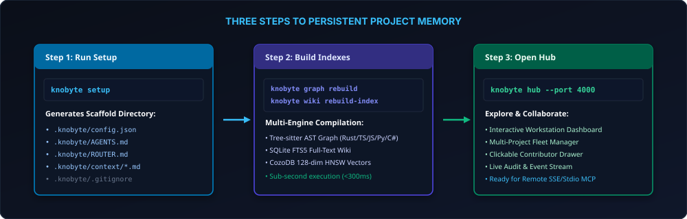

# Getting Started



Official Website: **[https://knobyte.ai](https://knobyte.ai)**

This guide builds Knobyte, sets it up in a repository, populates the project memory, and runs a
first drift check. Every output shown here comes from a real run on a three-file Rust project
(`src/main.rs`, `src/auth.rs`, `src/password.rs`) on a machine with the Claude Code CLI and Cursor
installed. Absolute paths and hashes are shortened.

---

## 1. Install

### Download a prebuilt binary

Each [release](https://github.com/gustaveherbst/knobyte/releases/latest) has an archive per
platform, with a SHA-256 checksum next to it:

| Platform | Archive |
|---|---|
| macOS (Apple Silicon) | `knobyte-aarch64-apple-darwin.tar.gz` |
| Linux (x86-64) | `knobyte-x86_64-unknown-linux-gnu.tar.gz` |
| Linux (arm64) | `knobyte-aarch64-unknown-linux-gnu.tar.gz` |
| Windows (x86-64) | `knobyte-x86_64-pc-windows-msvc.zip` |

```bash
shasum -a 256 -c knobyte-aarch64-apple-darwin.sha256   # optional: verify the download
tar -xzf knobyte-aarch64-apple-darwin.tar.gz
sudo mv knobyte /usr/local/bin/                          # or any directory on your PATH
```

**macOS:** the binary is not notarized by Apple, so macOS quarantines it when it is downloaded with
a browser and refuses to open it ("cannot be opened because the developer cannot be verified").
Clear the quarantine flag once:

```bash
xattr -d com.apple.quarantine /usr/local/bin/knobyte
```

Downloads made with `curl` or `wget`, and binaries you build yourself, are not quarantined and need
no extra step.

### Build from source

Knobyte is a single Rust binary. Building it needs **Rust 1.90+**, `cargo` and a C compiler,
because SQLite, the Tree-sitter grammars and `ring` bundle C code. Nothing else is needed at
runtime: no Node.js, no Python, no database server.

```bash
git clone https://github.com/knobyte-ai/knobyte.git
cd knobyte
cargo build --release          # binary: target/release/knobyte
cargo install --path .         # optional: install into ~/.cargo/bin
knobyte --version
```

There is no npm package. Install from source or copy the binary onto your `PATH`.

---

## 2. Set up a repository

Run setup from the repository root. It is one command; your input is two or three keystrokes:

```bash
knobyte setup
```

```text
[info] Detected: existing codebase with source files

Scaffold
[ok] Created .knobyte/config.json (project configuration (mode: code-repo))
[ok] Created .knobyte/.gitignore (ignore derived databases and checkout-local state)
[ok] Created 11 scaffold documents in .knobyte/

AI tools
[info] Detected:
    Claude Code      claude on PATH
    Cursor           Cursor.app
Set up Knobyte for Claude Code, Cursor? [Y/n/e = edit list]
[ok] Created .cursorrules
[ok] Install the knobyte-inbox skill at .claude/skills/knobyte-inbox.
[ok] Install the knobyte-relay skill at .claude/skills/knobyte-relay.
[ok] Create CLAUDE.md with the managed Knobyte instruction block.
[ok] Created .mcp.json (Knobyte MCP server for Claude Code)
[ok] Created .cursor/mcp.json (Knobyte MCP server for Cursor)

Indexing
  [1/4] scan          3 source files (1.3 KB)
  [2/4] code graph    3 files, 11 symbols, 26 edges
  [3/4] vector index  14 code nodes (hashed-v1, 128-dim)
  [4/4] wiki index    11 entities

Population
[info] Not launching Claude Code: agent launch is disabled by KNOBYTE_NO_AGENT_LAUNCH.
[info] Population pending: the docs keep their "to fill" markers. Your first agent session sees them (its Knobyte instructions say so), fills the docs from the code and runs `knobyte setup --finish`.
[info] To populate by hand instead: `knobyte setup --print-prompt` prints the full prompt.

Finalizing
[ok] Wiki index ready with 11 entities; baselines are captured by `knobyte setup --finish` once the docs are populated

Setup summary
  Tools           Claude Code: CLAUDE.md, skills, .mcp.json (MCP)
                  Cursor: .cursorrules, .cursor/mcp.json (MCP)
  Code graph      3 files, 11 symbols, 26 edges
  Vector index    ready (hashed-v1, 128-dim): 14 code nodes, 11 wiki pages
  Docs            11 created, 0/7 populated (population pending: your first agent session finishes it)
  Wiki index      11 entities, 0 grounding baseline(s) captured
  Drift score     100/100
  Central symbol  login (src/auth.rs, used from 1 file)

Try asking your agent: "Use Knobyte to explain how login works."

Commit
Commit Knobyte's files now (staging only Knobyte's paths, nothing is pushed)? [y/N]
[info] Nothing was staged or committed. To commit Knobyte's files later:
    git add -- .knobyte CLAUDE.md .claude/skills/knobyte-inbox .claude/skills/knobyte-relay .cursorrules .mcp.json .cursor/mcp.json
    git commit -m "chore: initialize Knobyte project memory"
```

(This run had agent launching turned off with `KNOBYTE_NO_AGENT_LAUNCH=1`, so it shows the path
where nobody populates the docs yet. With launching allowed, the Population step instead shows
the launch preview and asks one more question; see [section 3](#3-populate-the-memory).)

What happened, step by step:

1. **Detection.** Setup looks for agent CLIs on `PATH` (`claude`, `codex`, `cursor`, `windsurf`,
   `code` / `code-insiders` for Copilot, `opencode`), app bundles in `/Applications`, user
   configuration directories (`~/.claude`, `~/.codex`, `~/.cursor`, `~/.codeium/windsurf`,
   `~/.config/opencode`) and project directories (`.claude`, `.cursor`, `.vscode`, `.windsurf`,
   `.opencode`). It shows what it found once: Enter accepts, `n` writes no tool files, `e` edits
   the list. Without a terminal it uses the detected list. When nothing is detected it writes
   `AGENTS.md` and `CLAUDE.md`, which most agents read, and says so.
2. **Wiring.** Each tool gets its instruction file, the Claude Code and Codex skills, and the
   Knobyte MCP server (`knobyte mcp --stdio --profile core`) in the tool's own configuration
   file. Existing files are merged, never overwritten. Windsurf's MCP file lives in your home
   directory, so setup asks before touching it (or takes `--global-mcp`).
   [Agent integration](agent-integration.md) lists every file.
3. **Indexing**, in one display: the scan, the code graph, the vector index (code and wiki
   embeddings with the configured backend; the default `hashed` backend needs no download) and
   the wiki search index.
4. **Population** (next section), then **finalizing**, the **summary** with a first question
   for your agent, and the **commit**, which is always the last question and defaults to no.

Options you may want:

- `--tools claude,codex` chooses the tools yourself (`claude`, `codex`, `cursor`, `windsurf`,
  `copilot`, `opencode`, or `none`); it overrides detection and the saved `aiTools`.
- `--no-mcp` skips MCP registration; `--global-mcp` allows the user-level Windsurf file.
- `--dry-run` lists everything setup would write.
- `--commit` commits Knobyte's files without asking.

Setup also creates the empty team directories (`events/`, `team/members/`, `workstreams/`,
`specs/`, `inbox/`, `relays/`, `topics/`, `local/`). If the repository already has a root
`.gitignore`, setup appends Knobyte's database rules to it.

### Modes

`--mode` picks one of four modes:

- `code-repo` is the default.
- `agent-memory` is a memory workspace with no code graph or codebase scan, and it adds `HEARTBEAT.md`.
- `monorepo` and `docs-only` scaffold like `code-repo` but skip the Git checks and the commit
  checkpoint.

The mode is saved, so later runs reuse it.

---

## 3. Populate the memory

The new context files are templates. Each one starts with a `<!-- knobyte:populate -->` marker.
An agent fills them from the code graph, with readable groundings (`kind:path:qualified_name`)
for the claims that depend on specific code.

**Launch an agent during setup.** When the Claude Code or Codex CLI is installed and you run
setup in a terminal, setup shows the exact command, the working directory and the pre-approved
read-only `knobyte` commands, then asks `Launch Claude Code to populate the docs now? [Y/n]`.
`--launch-agent` launches without the question (your explicit consent). When the agent
finishes, setup continues straight to finalizing in the same run.

**Or let your first agent session do it.** With `--no-agent`, in a non-interactive shell, in
`CI`, with `KNOBYTE_NO_AGENT_LAUNCH=1`, or when you answer no, setup does not wait. It finishes
everything else and leaves the markers. Every place your agent reads at the start of a session
says what to do next: the managed block in `CLAUDE.md` / `AGENTS.md`, the tool rule files, a
"Population pending" note in `.knobyte/AGENTS.md` and `ROUTER.md`, and the MCP server's
instructions and `knobyte_session_start`. The agent fills the files (the full prompt is
`knobyte setup --print-prompt`), removes the markers, and runs:

```text
$ knobyte setup --finish
[info] Detected: existing codebase with a populated scaffold
[info] Finishing setup: re-scan, finalize, capture grounding baselines, report

Scaffold
[info] Scaffold is up to date; existing files were preserved

AI tools
[info] Using configured AI tools: Claude Code, Cursor
[info] .cursorrules already points at .knobyte/; left unchanged
[info] Agent skills and instruction blocks are up to date
[info] .mcp.json already registers the Knobyte MCP server (Claude Code)
[info] .cursor/mcp.json already registers the Knobyte MCP server (Cursor)

Indexing
  [1/4] scan          3 source files (1.3 KB)
  [2/4] code graph    3 files, 11 symbols, 26 edges
  [3/4] vector index  14 code nodes (hashed-v1, 128-dim)
  [4/4] wiki index    11 entities

Finalizing
[ok] Captured 3 grounding baseline(s)
[ok] Wiki ready with 11 indexed entities

Setup summary
  Tools           Claude Code: CLAUDE.md, skills, .mcp.json (MCP)
                  Cursor: .cursorrules, .cursor/mcp.json (MCP)
  Code graph      3 files, 11 symbols, 26 edges
  Vector index    ready (hashed-v1, 128-dim): 14 code nodes, 11 wiki pages
  Docs            7/7 populated
  Wiki index      11 entities, 3 grounding baseline(s) captured
  Drift score     100/100
  Central symbol  login (src/auth.rs, used from 1 file)

Try asking your agent: "Use Knobyte to explain how login works."

Commit
[info] Nothing was staged or committed. To commit Knobyte's files later:
    git add -- .knobyte CLAUDE.md .claude/skills/knobyte-inbox .claude/skills/knobyte-relay .cursorrules .mcp.json .cursor/mcp.json
    git commit -m "chore: initialize Knobyte project memory"
```

A checkout-local marker, `.knobyte/local/setup-pending`, tells `--finish` (or a plain re-run)
that it completes a fresh setup, so it captures the grounding baselines. Until then,
`knobyte check` lists each marked file as `POPULATION_PENDING` information, which does not lower
the drift score.

Capturing baselines writes each grounding's hash into the Markdown, so the baselines are
committed with the documentation:

```markdown
<!-- kb-ground: function:src/auth.rs:validate_token #5e9293d6b839… -->
```

Frontmatter `grounds_to` entries get `body_hash` and `fingerprint` fields the same way.

Setup never commits unless you pass `--commit` or confirm the prompt, and it never pushes.

The [Project Hub](hub.md) runs the same flow in the browser: `knobyte` on a repository without a
scaffold opens its Setup page.

---

## 4. Check health

```text
$ knobyte check
Drift score: 100/100 — 0 errors, 0 warnings, 0 info
13 files checked
Groundings: 100.0% intact (3 intact, 0 changed, 0 moved, 0 ambiguous, 0 gone, 0 unverified of 3)
graph fresh
[ok] All scaffold files pristine and in sync with codebase.
```

```text
$ knobyte doctor
knobyte doctor
Scaffold: …/demo/.knobyte

ok Drift       100/100 (0 errors, 0 warnings)
ok Graph       fresh; 3 files, 12 nodes, 19 edges
ok Coverage    all recognized source files are indexable
ok Heartbeat   HEARTBEAT_OK
ok Events      0 logged events
ok Wiki        ready (11 entities)
ok CozoDB      not initialized
ok Embeddings  hashed (128-dim)
ok Config      config.json loaded (mode: code-repo, git: yes)
```

Commit `.knobyte/`, the agent files, `CLAUDE.md` / `AGENTS.md` and the project MCP files (setup's
commit question does exactly that). The databases and `local/` are already git-ignored.

---

## 5. Register yourself

```bash
knobyte member add alex --name "Alex Rivera" --role engineer --select
```

Name and email default to your `git config`. Knobyte never creates members implicitly. When no
member is selected, the actor is the registered member whose email or Git alias matches
`git config user.email`.

---

## 6. Explore

```bash
knobyte graph query who-calls validate_token      # method Session::is_valid (src/auth.rs:8:4)
knobyte graph scope "session token validation"    # ranked files, source and flows for a task
knobyte impact validate_token                     # transitive blast radius
knobyte wiki query token                          # ranked wiki search
knobyte cozo sync && knobyte cozo search "token validation" --k 3
knobyte hub                                       # the Project Hub in your browser
```

---

## 7. When the code changes

After an edit to `validate_token` and a move of `verify_password` into `src/crypto.rs`:

```text
$ knobyte graph refresh
[ok] Refreshed code graph (incremental) in 3ms: 1 added, 2 modified, 1 deleted; 3 files re-extracted, 0 reused from cache. Totals: 3 files, 9 symbols, 19 relationships. Status: fresh.

$ knobyte check
WARNING

.knobyte/context/architecture.md
  ! GROUNDING_DRIFT Grounded node body changed: function:src/auth.rs:validate_token (src/auth.rs:13). Review the documentation, then run `knobyte graph ground --rebaseline` to accept the current code.
  ! GROUNDING_DRIFT:36 Inline anchor should move: function:src/password.rs:verify_password; candidate: function:src/crypto.rs:verify_password (Exact AST body hash match for function symbol, confidence 100%). Run `knobyte sync` (or `knobyte check --fix`) to rewrite it.

Drift score: 94/100 — 0 errors, 2 warnings, 0 info
12 files checked
Groundings: 33.3% intact (1 intact, 1 changed, 1 moved, 0 ambiguous, 0 gone, 0 unverified of 3)
```

- `knobyte sync` (or `knobyte check --fix`) rewrites the moved reference.
- Once you have reviewed the prose against the new body, `knobyte graph ground --rebaseline`
  accepts the changed code.

[Grounding and drift](grounding-and-drift.md) covers the full workflow.

---

## Joining a repository that already uses Knobyte

```bash
git pull
knobyte setup                 # build this checkout's code graph and wiki index
knobyte member current        # Current member: Sam Lee (sam) via git-alias
knobyte member select <id>    # or: knobyte member add <id> --select
```

The canonical files arrive through Git, including the project MCP files, so your agent picks up
the Knobyte server as soon as you open the repository. Each checkout builds its own `graph.db`,
`wiki.db` and `cozo.db`. On a scaffold that is already populated, `knobyte setup` does not modify
tracked files: it creates missing directories, rebuilds the code graph, vector index and wiki
index, and reports instead of writing.

```text
[info] Detected: existing codebase with a populated scaffold
[info] The scaffold is already populated: tracked files stay as they are; setup refreshes local state (graph, vectors, wiki index)
...
AI tools
[info] Using configured AI tools: Claude Code, Cursor
[info] .cursorrules already points at .knobyte/; left unchanged
[info] Agent skills and instruction blocks are up to date
[info] .mcp.json already registers the Knobyte MCP server (Claude Code)
[info] .cursor/mcp.json already registers the Knobyte MCP server (Cursor)
...
Finalizing
[ok] Wiki index rebuilt with 11 entities; tracked scaffold files were not modified
```

- Scaffold files that `knobyte update` would refresh are listed, not written.
- The tools are the repository's saved `aiTools`, not the ones detected on your machine. Agent
  files (instruction blocks, skills, MCP registrations, `aiTools`) are written only when you
  pass `--tools`; otherwise setup reports what is missing.
- Grounding baselines are captured only with `--capture-baselines` (or
  `knobyte graph ground --rebaseline`), which leaves Markdown changes for you to review and
  commit.
- There is no commit question on a re-run (unless you pass `--tools`, `--finish` or
  `--capture-baselines`).

---

## Next

- [Agent integration](agent-integration.md): what setup writes for each agent.
- [Team workflows](team-memory-workflows.md): Inbox, Relays, Members and Workstreams.
- [CLI reference](cli-reference.md): every command and flag.
