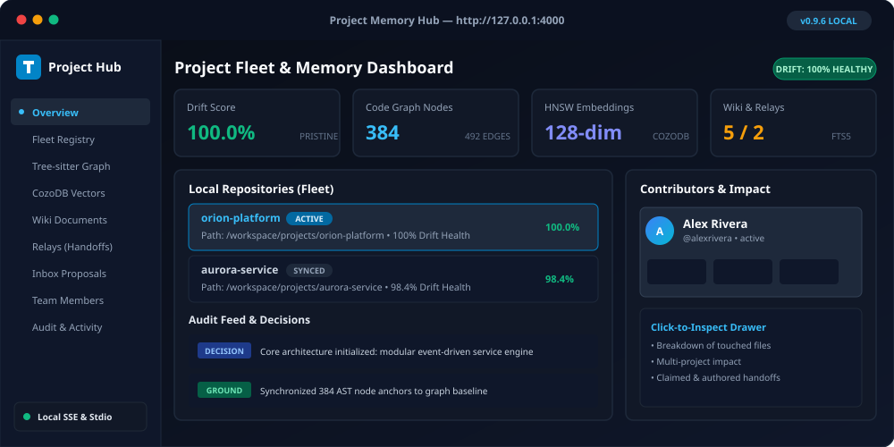

# Project Hub



Official Website: **[https://knobyte.ai](https://knobyte.ai)**

The Project Hub is a local web interface where people explore, review and maintain the project's
memory. Each engineer runs their own Hub against their own checkout. It is not a hosted,
shared dashboard; the team's records reach it through Git.

```bash
knobyte hub                     # 127.0.0.1:4000, opens the browser
knobyte hub --port 4711 --no-open
knobyte                         # same as `knobyte hub`; opens the Setup page if there is no scaffold yet
```

---

## Signing in

The Hub requires a browser session **even on loopback**. At startup it prints a one-time
sign-in link:

```text
[hub] Knobyte Project Hub running on http://127.0.0.1:4711
[hub] One-time sign-in link (valid for 5 minutes):
      http://127.0.0.1:4711/#token=<one-time token>
[hub] Browser not opened (--no-open); open the link above.
```

Opening the link exchanges the token, which is single use and valid for 5 minutes, for a session
cookie (`HttpOnly`, `SameSite=Strict`, 12 hours). The token sits in the URL fragment, so it is
never sent in a request line, and the page removes it from the address bar. If the link has
expired, restart `knobyte hub` to get a fresh one. **Settings → Sign out** ends the session.

### Access tokens and remote binds

- `--token <secret>` or `KNOBYTE_HUB_TOKEN` sets a reusable access token. Open
  `http://host:port/#token=<secret>` as often as needed, or send it as
  `Authorization: Bearer <secret>` for scripted API calls.
- Binding to a non-loopback address (`--host 0.0.0.0`) **requires** a token. If none is given,
  the Hub generates one and prints a reusable access link on stderr.

### Request protection

- Every state-changing request is a `POST` that must come from the Hub's own origin and carry the
  session's CSRF token (header `X-Knobyte-CSRF`).
- `Host` and `Origin` are validated against the bind address, which blocks DNS rebinding.
- On loopback, proxy headers such as `X-Forwarded-For` are refused.
- Responses carry a strict Content-Security-Policy and `X-Frame-Options: DENY`.

### Liveness

`GET /healthz` answers `{"hub":"knobyte","status":"ok"}` without a session. Every `/api/*` route
answers `401` without one.

---

## Pages

| Group | Page | What you can do |
|---|---|---|
| | **Overview** | See what needs attention, the next action, context readiness, the latest team memory and the active job. |
| Project | **Context** | Explore the graph of wiki entities, their relations and the code they are grounded in. Pan, zoom and select with the keyboard. |
| | **Knowledge** (`/knowledge/<id>`) | Read one entity: groundings with source, a **drift panel** (committed baseline vs current source, drift codes, sync preview; the baseline hash is read from the Markdown, and when a teammate re-baselined since this checkout cached the old source, the panel says the old source is not available locally and shows the current one), a **supersession timeline**, an **evidence panel** (sources, provenance, grounding health, traceability), relations, backlinks and body. "Propose an update" opens an Inbox draft. |
| | **Search** (press `/`) | Hybrid search: full-text matches fused with CozoDB vector matches over wiki and code, with scope, mode, type and kind filters. Shows the active embedding backend. |
| | **Code** (`/code`, `/code/symbols/<id>`) | Find symbols, then open their source, callers, callees, impact and the knowledge grounded in them. |
| | **Inbox** | Review proposals as diffs with their evidence. Approve, reject, withdraw, mark stale or repair. Author knowledge, spec or file-edit drafts and publish them. |
| | **Specs** | Specs by lifecycle. Each detail page shows requirements, acceptance criteria, constraints, groundings and the health rollup, with "propose an update". |
| | **Groundings** | Drift KPIs and issues. Preview the relocations `knobyte sync` would make, then apply them after confirming. |
| Teamwork | **Catch up** | What changed since you last caught up: handoffs for you, proposals awaiting your review, decisions, knowledge, workstream and playbook changes. Filter by window or include your own changes; "Mark caught up" moves only this checkout's cursor (`.knobyte/local/catch-up/`). |
| | **Relays** | Compose relay drafts with a recipient picker, publish them, and acknowledge and close relays. Lists show all, mine or sent. |
| | **Workstreams** | Workstreams by state, with steps, checkpoints and linked relays. Create and update them. |
| | **Playbooks** (`/playbooks`, `/playbooks/<id>`, `/playbooks/runs/<run-id>`) | Playbooks by state and all runs. Create and edit playbooks (steps with description, checks and expected evidence), publish drafts, archive, start a run (optionally linked to a workstream), complete a step with evidence and a note, or abandon a run. |
| | **Activity** | A feed of decisions, discoveries, risks and team activity, filtered by kind and date. |
| | **Team** | Members with contribution metrics. Add, update, deactivate, reactivate, select or clear members. The top bar shows who you are "working as" and lets you switch. |
| System | **Health** | Cards for git, the code graph, wiki, Cozo/embeddings and the Hub: indexed vs HEAD, changed paths, parse coverage and failures. Refresh and Rebuild run as jobs. |
| | **Jobs** | Start index jobs, watch phased progress live, cancel them and see their history. |
| | **Setup** | The setup wizard (below). |
| | **Settings** | Agent logging cadence, onboarding tour and Sign out. |
| | **Fleet** | Every Knobyte repository registered on this machine, with health status. |
| | **MCP** | The MCP tool profiles (the project default and how it was chosen), the tools in each profile, and how to start the server. |

Team mutations in the Hub use the same preview → apply envelopes as the CLI, so you always
review the exact file changes first. See [Team workflows](team-memory-workflows.md#preview-and-apply).
Nothing in the Hub commits or pushes, except the Setup page's commit step, which commits only
the files you reviewed.

---

## Jobs

Only one job runs at a time. Starting another while one is active is refused. Cancelling stops a
running job at its next phase boundary, before anything is published. The last 50 jobs are kept
in `.knobyte/local/hub/jobs.json`.

| Job | Does |
|---|---|
| Graph refresh | Re-extracts changed files and publishes atomically |
| Graph rebuild | Parses every file and replaces the code graph (asks for confirmation) |
| Wiki refresh | Indexes changed scaffold Markdown |
| Wiki rebuild-index | Rebuilds the wiki index from scratch (asks for confirmation) |
| Cozo sync | Synchronizes graph and wiki into CozoDB for vector search |
| Drift check | Runs the drift checkers |

---

## Setup wizard

On a repository without a scaffold, the Hub opens on **Setup**. The wizard walks through these
steps:

1. **Initialize Git**, if needed. It asks first and commits nothing.
2. **Set up:** the same flow as `knobyte setup`. The AI tools detected on this machine are
   preselected (a "detected" badge shows the evidence on hover). Each selected tool gets its
   instruction files, skills and MCP server registration (uncheck **Register the Knobyte MCP
   server** to skip it; Windsurf's user-level file needs its own checkbox). The repository is
   then indexed: scan, code graph, vector index and wiki index. This never launches an agent;
   the run shows which MCP files were written and the setup summary.
3. **Populate** (optional). The wizard previews the exact command, working directory and
   timeout. You confirm a launch of Claude Code or Codex, copy the prompt into your own agent,
   or choose **Continue without populating**: the docs stay marked to fill and your first agent
   session completes them and runs `knobyte setup --finish`. The confirmation dialog says the
   agent will edit files under `.knobyte/`. The transcript streams live, and you can cancel.
4. **Finalize** (after population): capture grounding baselines, refresh the wiki and vector
   indexes, and show the summary with a first question to ask your agent.
5. **Commit:** review the exact files and per-file diffs, then commit only those. The default
   message is `chore: initialize Knobyte project memory`. The review is refused if any file
   changed since you looked. Nothing is pushed.

---

## Fleet

Each Hub registers its project in `~/.knobyte/projects.json` when it starts. `KNOBYTE_HOME`
overrides the directory. The Fleet page lists those projects, plus sibling directories that hold
a `.knobyte/config.json`. Each project shows as `healthy`, `warning`, `drifted` or
`unavailable`.
