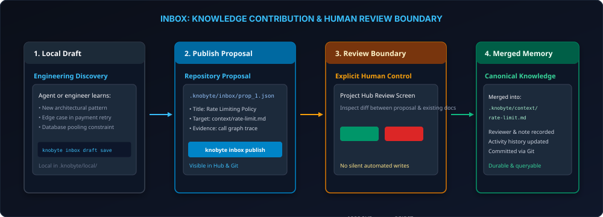

# Team Workflows

Official Website: **[https://knobyte.ai](https://knobyte.ai)**

Knobyte's team features are **Members**, the **Inbox** (reviewed knowledge proposals),
**Relays** (handoffs), **Workstreams**, **Playbooks**, **Specs**, **Activity**, the **event log**
and the personal **Catch up** digest. Every
canonical record is a file under `.knobyte/` that you share through Git. Drafts, the
current-member selection and the signing key stay in the checkout-local `.knobyte/local/`.

All examples on this page come from one real session: Alex Rivera and Sam Lee in the same
repository, switching with `knobyte member select`. In real use each person works in their own
checkout.

---

## Where things live

| Record | Path | Shared |
|---|---|---|
| Members | `.knobyte/team/members/<id>.json` | yes |
| Inbox proposals | `.knobyte/inbox/prop_<uuid>.json` | yes |
| Relays | `.knobyte/relays/relay_<uuid>.json` | yes |
| Workstreams | `.knobyte/workstreams/<id>.json` | yes |
| Playbooks | `.knobyte/playbooks/<id>.json` | yes |
| Playbook runs | `.knobyte/playbooks/runs/run-<id>.json` | yes |
| Specs | `.knobyte/specs/**/*.md` | yes |
| Activity | `.knobyte/events/activity/<uuid>.json` | yes |
| Event log | `.knobyte/events/decisions.jsonl` | yes |
| Inbox / relay drafts | `.knobyte/local/inbox_drafts/`, `.knobyte/local/relay_drafts/` | no |
| Current member | `.knobyte/local/current_member.json` | no |
| Catch-up cursors | `.knobyte/local/catch-up/<actor>.json` | no |
| Signing key, operation journal | `.knobyte/local/signing.key`, `.knobyte/local/team-journal/` | no |

---

## Who is acting

Every mutation is attributed to the **current actor**, resolved in this order:

1. **`configured-member`:** the member selected in this checkout with `knobyte member select <id>`,
   if that member is active.
2. **`git-alias`:** exactly one active member whose email or Git alias matches `git config`.
   If several match, Knobyte reports `ACTOR_ALIAS_AMBIGUOUS` and falls through.
3. **`git-fallback`:** the raw Git identity (`git:<email>`). This is enough for reading and for
   drafts, but not for actions that need an active member.
4. **`unknown`:** there is no Git identity at all.

```text
$ knobyte member current
Current member: Alex Rivera (alex) via configured-member
Local selection: alex (since 2026-10-02T02:02:06.793Z)
```

**No acting as another member.** Some flags name the expected actor: `--member` on inbox
reviews and relay publish, acknowledge and close, and `--sender` on relay drafts. These are
assertions only. If the name differs from the resolved actor, the command is refused:

```text
$ knobyte inbox approve prop_9a6a… --member sam
[error] UNAUTHORIZED: ACTOR_MISMATCH: requested member 'sam' is not the current actor ('alex'); a caller cannot act as another member. That member must act from their own checkout.
```

Members are attribution, not authentication. They are not passwords or permission boundaries.

---

## Preview and apply

Every state-changing team command (`member`, `activity record`, `workstream`, `inbox`, `relay`)
runs in one of three ways:

- **One step (the default):** plan the change and write it.
- **`--preview`:** show the exact files that would change, and write nothing.
- **`--preview --json` then `--apply <file>`:** save a signed envelope, review it, then apply
  exactly that.

```text
$ knobyte inbox publish draft_acd1… --preview
Preview: Publish proposal 'Tokens need more than 8 characters' for context/tokens-need-more-than-8-characters.md
Scope: mixed | Operation: op_aa8835c57ecb47cf983b37b7dbf02d72
  create inbox/prop_f1b1….json (canonical) - Publish inbox proposal
  delete local/inbox_drafts/draft_acd1….json (local) - Remove published inbox draft
  create events/activity/0f60….json (canonical) - Record activity inbox.publish
Preview revision: sha256:014e29f1…
Save it with --preview --json > preview.json, then apply with --apply preview.json (valid 30 minutes).

$ knobyte inbox publish draft_acd1… --preview --json > preview.json
$ knobyte inbox publish --apply preview.json
[ok] Published inbox proposal 'prop_9a6a…': Tokens need more than 8 characters
```

The envelope contains:

- the request;
- every planned change, each with its namespace (`canonical` or `local`) and its before and after
  `sha256:` revisions;
- a receipt with the actor, the actor source, the timestamp, the repository state (branch, HEAD,
  dirty tree), the ids minted for the operation, and an HMAC signature made with this checkout's
  `.knobyte/local/signing.key`.

`--apply` is refused in these cases:

- the envelope was altered, or was issued by another checkout (`UNAUTHORIZED`);
- the current actor differs from the actor in the receipt (`UNAUTHORIZED`);
- the envelope is more than 30 minutes old (`REVISION_CONFLICT`);
- any file it read or would write has changed since the preview (`REVISION_CONFLICT`).

On a refusal, preview again.

Other flags:

- `--request <file>` takes the action from a JSON request instead of flags. The schemas come
  from `knobyte <group> contract`.
- `--operation-id <id>` fixes the operation id. Replaying the exact same operation succeeds
  with `idempotentReplay: true`. Reusing the id for different content is a conflict.

Writes go through an intent → complete journal in `.knobyte/local/team-journal/`. The next
mutation rolls an interrupted operation forward.

### JSON envelope and exit codes

With `--json`, team commands print:

```json
{ "schemaVersion": 1, "command": "inbox.publish", "mode": "read|preview|apply",
  "ok": true, "data": {}, "diagnostics": [], "problem": null }
```

On failure, `problem` is `{title, status, code, detail}` and the exit code follows its code:

| Exit | Codes |
|---|---|
| 0 | success, including an exact idempotent replay |
| 1 | `VALIDATION_FAILED`, `INTERNAL_ERROR` |
| 2 | `INVALID_REQUEST` (arguments, request JSON or envelope) |
| 3 | `NOT_FOUND`, or no Knobyte project |
| 4 | `REVISION_CONFLICT`, `OPERATION_INTERRUPTED` |
| 5 | `UNAUTHORIZED` (including `ACTOR_MISMATCH` and `SELF_APPROVAL_REQUIRED`), `PATH_OUTSIDE_PROJECT` |

Lists return bounded pages: `--limit` 1-100 (default 50), continued with `--cursor`. A cursor
is refused with `REVISION_CONFLICT` if the list changed underneath it.

### Contracts

`knobyte <group> contract [--action <name>] [--json]` prints a JSON Schema (draft 2020-12)
catalogue of request files for `member`, `activity`, `workstream`, `inbox` and `relay`:

| Group | Actions |
|---|---|
| member | `member.add`, `member.update`, `member.deactivate`, `member.reactivate`, `member.select`, `member.clear` |
| workstream | `workstream.create`, `workstream.update`, `workstream.archive`, `workstream.step.update` |
| activity | `activity.record` |
| inbox | `inbox.draft.save`, `inbox.draft.delete`, `inbox.publish`, `inbox.approve`, `inbox.reject`, `inbox.withdraw`, `inbox.mark-stale`, `inbox.repair` |
| relay | `relay.draft.save`, `relay.draft.delete`, `relay.publish`, `relay.acknowledge`, `relay.close` |

The inbox catalogue marks `inbox.approve` and `inbox.reject` as `humanOnly`.

---

## Members

```bash
knobyte member add alex --name "Alex Rivera" --role engineer --select
knobyte member add sam --name "Sam Lee" --email sam@example.com --role engineer
knobyte member list
knobyte member update sam --alias "Sam Lee <sam@users.noreply.example.com>"
knobyte member select sam           # this checkout acts as sam
knobyte member clear
knobyte member deactivate sam       # history is kept; knobyte member reactivate sam restores it
```

```text
$ knobyte member list
- Alex Rivera (alex) [active] engineer
- Sam Lee (sam) [active] engineer
```

A member has an id (lowercase slug), display name, optional email and role, up to 16 Git
aliases, and a status of `active` or `inactive`. On `add`, the name and email default to
`git config`. Inactive members cannot be selected, named as recipients, review proposals or
act. You cannot deactivate the member this checkout has selected; clear the selection first.

---

## Inbox: reviewed knowledge changes



Agents and people propose changes. A teammate reviews them, and only approval changes canonical
knowledge.

### Kinds of change

| `--change` | Fields | Approval writes |
|---|---|---|
| `knowledge.create` | `--kind` (architecture, component, convention, decision, pattern, guide), `--title`, `--body`, `--summary`, `--status`, `--topic` | a new entity at `context/<slug>.md` (`patterns/<slug>.md` for patterns) |
| `knowledge.update` | `--entity <id>`, any of `--title`, `--summary`, `--body`, optional `--target-revision` | a patch to that entity, with its `revision` incremented |
| `spec.create` | `--kind` (spec, requirement, constraint, acceptance_criterion) plus the create fields and `--relation <type>:<id>` | a new file under `specs/` |
| `spec.update` | like `knowledge.update`, for spec entities | a patch to the spec entity |
| *(legacy)* | `--target <file.md> --content … [--mode append\|replace]` | appends to or replaces a Markdown file under `.knobyte/`, bumping its frontmatter `last_updated`; a file that does not exist yet is created as an entity (`id: kb_<file stem>`, the proposal title, a type inferred from the path, `status: in_flight`, the reason as `summary`, `last_updated`, `revision: 1`) |

Every draft needs `--reason`. `--evidence` accepts `entity:<id>`, `code:<symbol>`,
`commit:<hash>`, `file:<path>`, a URL or a free-text note, and is repeatable.

To correct an existing record, first read its exact revision:

```text
$ knobyte inbox target kb_conventions
Coding Conventions (kb_conventions)
Kind: convention | Source: context/conventions.md
Revision: 1 / sha256:0c891a95…
```

### Lifecycle

```text
draft (local) ──publish──▶ pending ──approve──▶ approved
                              │ ├──reject───▶ rejected
                              │ ├──withdraw─▶ withdrawn   (author only)
                              │ └─mark-stale─▶ stale ──repair──▶ pending
```

```text
$ knobyte inbox draft save --change knowledge.create --kind decision \
    --title "Tokens need more than 8 characters" \
    --body "validate_token rejects tokens of 8 characters or fewer." \
    --reason "Captured while hardening auth" --evidence code:function:src/auth.rs:validate_token
[ok] Saved inbox draft: draft_acd1… (target: context/tokens-need-more-than-8-characters.md)

$ knobyte inbox publish draft_acd1…
$ knobyte inbox proposal list
- [pending] Tokens need more than 8 characters (prop_9a6a…) - context/tokens-need-more-than-8-characters.md
```

### Review and the self-approval guard

You may not approve a proposal you authored, or one you **repaired**, because a repairer
rewrote its content and counts as an author:

```text
$ knobyte inbox approve prop_9a6a… --note "Matches the code"
[error] UNAUTHORIZED: SELF_APPROVAL_REQUIRED: you authored or repaired this proposal. Ask a teammate to review it, or explicitly confirm self-approval (selfApprove) to approve it without teammate review.
Hint: pass --self-approve to approve your own proposal.
```

`--self-approve` approves anyway. The proposal records `selfApproved: true` and the approval
carries the warning `INBOX_SELF_APPROVED`. Contributors cannot reject their own proposal; the
author withdraws it instead. A teammate approves:

```text
$ knobyte member select sam
$ knobyte inbox approve prop_9a6a… --note "Matches the code"
[ok] Approved proposal 'prop_9a6a…' -> .knobyte/context/tokens-need-more-than-8-characters.md

$ knobyte inbox proposal show prop_9a6a…
# Tokens need more than 8 characters (prop_9a6a…)
State: approved | Target: .knobyte/context/tokens-need-more-than-8-characters.md | Change: knowledge.create
Author: alex | Created: 2026-10-02T02:02:22.697Z
Rationale: Captured while hardening auth
Evidence: {"kind":"code","symbolId":"function:src/auth.rs:validate_token"}
Decision by sam at 2026-10-02T02:02:34.601Z: Matches the code
```

Approval also records `inbox.approve` activity and appends a `decision` event to the event log.

### Stale proposals

Publishing records the revision of every file the proposal targets. If a target changes
before review, approval is refused with `REVISION_CONFLICT`. Mark the proposal stale, then
repair it with fresh content:

```bash
knobyte inbox proposal mark-stale <id> --note "Conventions were rewritten"
knobyte inbox proposal repair <id> --from-draft <draft-id>   # or pass the draft fields directly
```

`inbox approve`, `inbox reject` and `inbox withdraw` are shorthands for the `inbox proposal …`
forms.

---

## Relays: handoffs

A relay packages what changed, what is in progress, the decisions made, blockers, open
questions, next actions, the changed files, code references and evidence. When it is
published it also records the branch, HEAD and whether the tree was dirty.

- **Audience `team`:** any active member may claim it. This is the default when there are no
  recipients.
- **Audience `members`:** only the named recipients (`--to`, repeatable, up to 32 active members)
  may claim it.

```text
$ knobyte relay draft save --title "Token length check" --summary "validate_token now rejects short tokens" \
    --audience members --to sam --completed "Added length check" \
    --next "Add tests for 8-character tokens" --blocker "No test fixtures yet" --workstream auth-hardening
[ok] Saved relay draft: draft_5861…

$ knobyte relay publish draft_5861…
[ok] Published relay 'relay_997d…': Token length check
[warn] RELAY_DIRTY_PUBLICATION: The working tree has uncommitted changes; the recipient may not see them.

$ knobyte relay show relay_997d…
# Token length check (relay_997d…)
Status: published | Sender: alex
Recipients: sam
Observed: branch main @ fb83df4b930a… (dirty)

validate_token now rejects short tokens

Completed:
  - Added length check

Blockers:
  - No test fixtures yet

Next actions:
  - Add tests for 8-character tokens
```

A relay must be **acknowledged before it can be closed**, and only the sender or the claimant
may close it:

```text
$ knobyte relay close relay_997d…
[error] VALIDATION_FAILED: Relay 'relay_997d…' has not been acknowledged yet; only an acknowledged relay can be closed

$ knobyte member select sam
$ knobyte relay acknowledge relay_997d…
[ok] Claimed relay 'relay_997d…' by sam
$ knobyte relay close relay_997d…
[ok] Closed relay 'relay_997d…'
```

The states are `published`, `acknowledged` and `closed`. `knobyte relay list --perspective mine`
shows relays addressed to you, and `--perspective sent` shows yours. Changed files are detected
from Git unless you pass `--changed-file` or `--no-auto-files`.

Publishing writes files in your checkout. Nothing is delivered until you commit and push.

---

## Workstreams

A workstream is a longer-running effort. It has a goal, owners, contributors, paths, code
symbols, topics, blockers, a current state and a next milestone. Its lifecycle is `planned`,
`active` (the default), `blocked`, `done` or `archived`.

```text
$ knobyte workstream create auth-hardening "Auth hardening" --goal "Reject weak tokens" --state active --owner alex --path src/auth.rs
[ok] Created workstream 'auth-hardening' (auth-hardening)

$ knobyte workstream show auth-hardening
# Auth hardening (auth-hardening) [active]
Goal: Reject weak tokens
Current state: Planned
Owners: alex
Paths: src/auth.rs
```

`workstream update` changes fields; use `workstream archive` to archive. **Steps and
checkpoints** record progress inside a workstream. Each step has a status of `pending`,
`in_progress`, `done`, `blocked` or `committed`. Each update appends a checkpoint with HEAD and
the dirty files. Agents update steps through the MCP tool `knobyte_workstream_step_update`, or a
`workstream.step.update` request file. Archived and done workstreams refuse step updates.

---

## Playbooks

A playbook is a reusable, step-by-step team procedure: a release, a key rotation, onboarding a
service. It has a title, summary, trigger ("when to use it"), owners, topics, prerequisites,
related records and ordered **steps**. Each step has a title, a description, optional
**required checks** and the **evidence** it is expected to produce.

A playbook's lifecycle is `draft` (the default), `active`, then `archived`. Only active
playbooks can be run; publishing a draft is `playbook update <id> --state active`. Archiving is
its own command, and an archived playbook is immutable. Creating, editing and archiving need an
active member; every change bumps the playbook's `entityRevision`.

```text
$ knobyte playbook create "Release a version" --state active --summary "Cut and publish a release" --step "Run the tests::cargo test --all::test output" --step "Update CHANGELOG" --step "Tag the release::Create the vX.Y.Z tag::tag commit"
[ok] Created playbook 'release-a-version' (release-a-version)
```

`--step` takes `"<title>[::<description>[::<evidence>;<evidence>...]]"` and is repeatable;
`playbook update --step ...` replaces the whole list. Required checks and explicit step ids are
set with a request file (see `knobyte playbook contract`).

A **run** records one execution. Starting a run snapshots the playbook's steps (later edits do
not change it) and can link it to a workstream. Each `complete-step` completes exactly one
pending step, attributed to the actor and stamped with HEAD, with evidence (`file:<path>`,
`commit:<sha>`, `entity:<id>`, `code:<symbol>`, a URL, or free text) and an optional note.
The step is named by its id or its 1-based number (`complete-step <run> 1`). Completed steps
are immutable. The run completes with its last step; `run abandon --reason`
ends it early. Completed and abandoned runs are immutable. Completing a step without the
evidence it expects succeeds with an `EVIDENCE_MISSING` warning.

```text
$ knobyte playbook run start release-a-version --workstream auth-hardening --title 1.4
[ok] Started playbook 'Release a version' (run run-559ab0744b96)

$ knobyte playbook run complete-step run-559ab0744b96 run-the-tests --evidence "412 passed" --evidence file:target/test-report.txt
[ok] Completed step 'Run the tests' of playbook 'Release a version' (run run-559ab0744b96)
2 step(s) remaining.

$ knobyte playbook run show run-559ab0744b96
# 1.4 (run-559ab0744b96) [active]
Playbook: release-a-version (revision 1)
Workstream: auth-hardening
Started by alex at 2026-10-02T13:38:40.386Z
  [x] Run the tests (run-the-tests)
      by alex at 2026-10-02T13:38:40.752Z
      evidence: 412 passed
      evidence: file target/test-report.txt
  [ ] Update CHANGELOG (update-changelog)
  [ ] Tag the release (tag-the-release)
      expects: tag commit
```

Every playbook and run change goes through preview/apply, the team lock and the journal, and
records activity (`playbook.create`, `playbook.run.complete-step`, ...). Agents complete steps
with the MCP tool `knobyte_playbook_complete_step`. They cannot create, publish or archive
playbooks, or start or abandon runs.

---

## Catch up

`knobyte catch-up` shows what changed in shared memory since **you** last caught up, grouped:

| Group | What it lists |
|---|---|
| `handoffs` | Relays addressed to you (or the whole team) that are new, plus relays still waiting for your acknowledgement |
| `reviews` | Pending proposals you did not author or repair, so you can review them |
| `decisions` | Decisions from the event log |
| `knowledge` | Wiki operations, proposal approvals and rejections |
| `workstreams` | Workstream changes |
| `playbooks` | Playbook and run changes |
| `activity` | Everything else (other log entries, relay acknowledgements, members, ...) |

Your own changes are hidden unless you pass `--include-mine`. Items older than your baseline
that still need you (an unacknowledged handoff, a pending review) stay listed as "still open".
`--since` overrides the baseline; `--workstream` and `--group` narrow the digest.

```text
$ knobyte catch-up
Catch up for alex since 2026-09-25T13:38:41.586Z (default window; no cursor yet)

DECISIONS (1)
  [2026-10-02T13:38:41.266490+00:00] decision: Release branches are cut from main on Mondays
      Release branches are cut from main on Mondays

Run `knobyte catch-up mark --at 2026-10-02T13:38:41.586Z` once you have read this.

$ knobyte catch-up mark
[ok] Caught up to 2026-10-02T13:38:41.643Z
```

The baseline is a per-actor **cursor** in `.knobyte/local/catch-up/`, never committed (Git
identities are hashed in the file name). Without a cursor the digest covers the last 7 days.
`catch-up mark [--at <time>]` moves it forward; pass the digest's `observedAt` so nothing that
arrived while you read is skipped. It never moves backwards. A cursor belongs to the branch it
was marked on: on another branch the digest warns `CATCH_UP_BRANCH_CHANGED` and `mark` is
refused until you run `catch-up reset` (`--to <time>` to rewind, `--clear` to delete it). Mark
and reset are local workflow actions: they support `--preview` and `--apply`, write only under
`.knobyte/local/` and record no activity. Agents read the digest with `knobyte_catch_up` and
move their own cursor with `knobyte_catch_up_mark`.

---

## Specs

Specs are wiki entities of type `spec` under `.knobyte/specs/`. Related entities connect to a
spec through relations:

- requirements use `derived_from` or `refines`;
- acceptance criteria use `verified_by`;
- constraints use `constrained_by`.

```bash
knobyte spec list --lifecycle in_flight --grounding changed
knobyte spec show specs/auth.md       # id or path
```

`spec show` prints the spec with its requirement hierarchy, acceptance criteria, constraints
and a grounding-health rollup. A spec's health is its worst grounding. New specs and spec
changes go through the Inbox (`spec.create`, `spec.update`). `knobyte wiki trace <id>` follows
the spec → requirement → decision → component → code → test chain and reports gaps.

---

## Activity and the event log

Every team mutation records an **activity** file, attributed to the actor and stamped with the
repository state:

```text
$ knobyte activity list
[2026-10-02T02:02:34.601Z] sam: Approved inbox proposal 'Tokens need more than 8 characters' into context/tokens-need-more-than-8-characters.md (created) (inbox.approve)
[2026-10-02T02:02:22.697Z] alex: Published inbox proposal 'Tokens need more than 8 characters' for context/tokens-need-more-than-8-characters.md (inbox.publish)
[2026-10-02T02:02:06.981Z] alex: Added team member 'Sam Lee' (sam) (member.add)
[2026-10-02T02:02:06.594Z] alex: Added team member 'Alex Rivera' (alex) (member.add)
```

`knobyte activity record <action> <summary>` adds a custom record. Subjects are given with
`--subject entity:<kind>:<id>`, `code:<symbol>`, `file:<path>` or `commit:<hash>`.

The **event log** (`events/decisions.jsonl`) holds decisions, discoveries, notes, risks and
todos:

```text
$ knobyte log "Tokens must be longer than 8 characters" --kind decision --tag security --file src/auth.rs
[ok] Logged decision: Tokens must be longer than 8 characters

$ knobyte timeline --kind decision
[2026-10-02T02:02:48.713077+00:00] decision - Tokens must be longer than 8 characters (src/auth.rs)
[2026-10-02T02:02:34.601Z] decision - Approved inbox proposal 'Tokens need more than 8 characters' for context/tokens-need-more-than-8-characters.md (.knobyte/context/tokens-need-more-than-8-characters.md)
```

`knobyte activity timeline` merges both sources, newest first. `--source activity|log`
filters to one, and `--since` accepts RFC 3339, `YYYY-MM-DD` or a relative `7d` / `12h`.

### How much agents log

`knobyte logging [significant|checkpoints|manual]` sets how much agents log unprompted in this
checkout. The default is `significant`. The setting is stored in
`.knobyte/local/agent-preferences.json` and never committed. Agents read it with
`knobyte logging --json`.

---

## What agents can and cannot do

| An agent can | Only a person does |
|---|---|
| Save inbox and relay drafts (CLI or MCP) | Publish drafts |
| Update workstream steps, log events | Approve or reject proposals |
| Complete playbook run steps with evidence | Create, publish or archive playbooks; start or abandon runs |
| Read every record; read and mark their own catch-up digest | Acknowledge and close relays |
| Plan and apply wiki operations | Commit and push |

There is no MCP tool for the right-hand column. The installed `knobyte-inbox` and
`knobyte-relay` skills also tell agents that invoking a skill is not approval.
